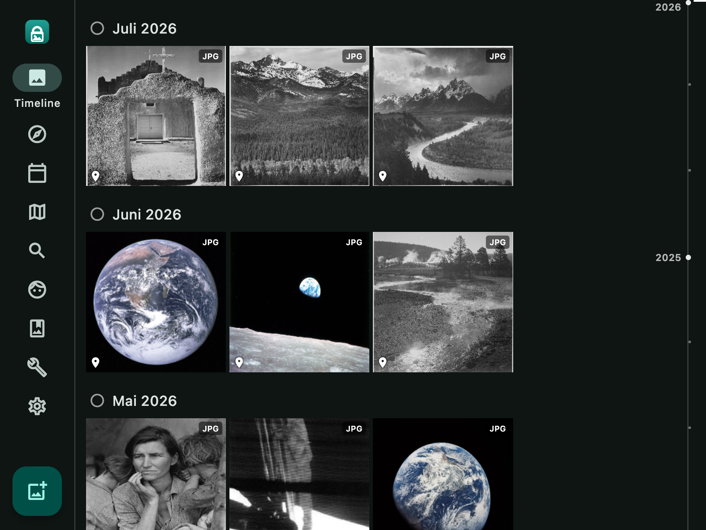
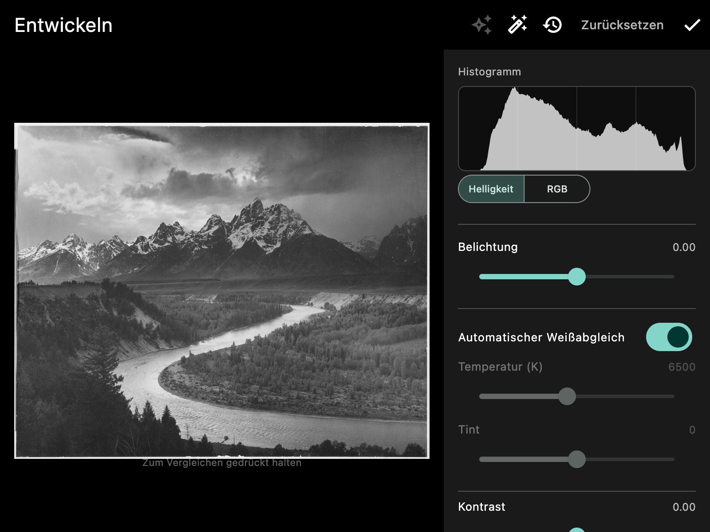
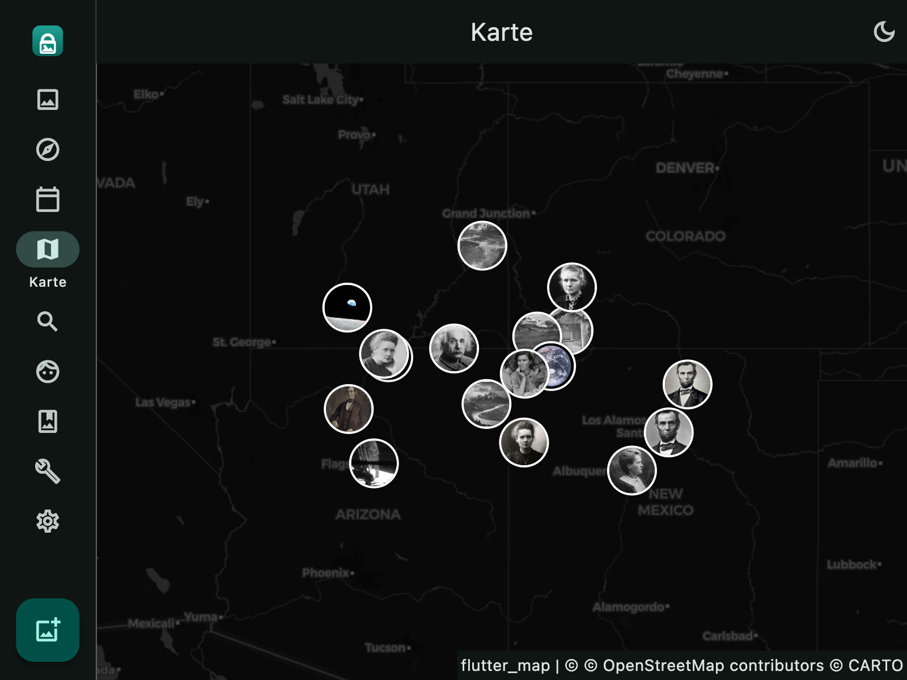
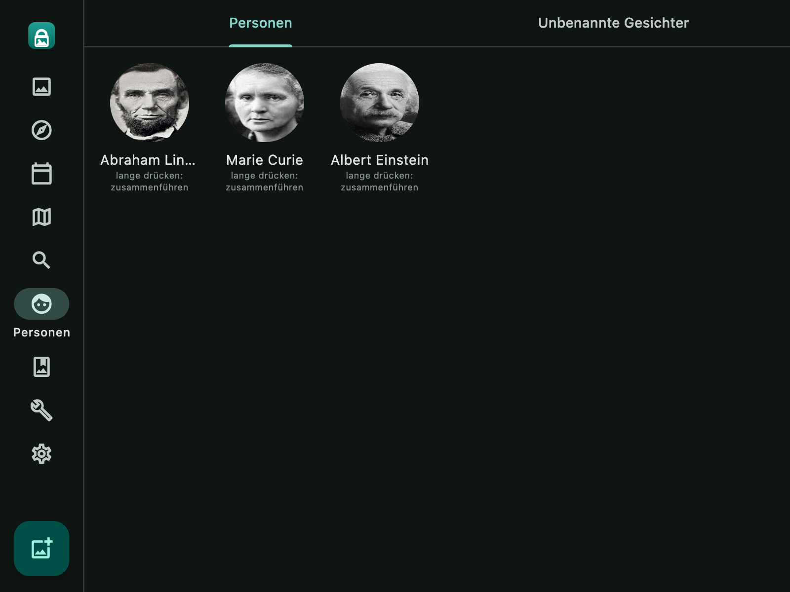

# Photo Vault

**Deine Fotobibliothek bleibt auf deinem Rechner.** Eine eigenständige
Foto- und Videoverwaltung für macOS – mit Gesichtserkennung, Bildsuche in
natürlicher Sprache und RAW-Entwicklung, aber **ohne Server, ohne Konto und
ohne Cloud-Dienst**.

Inspiriert von Immich, digiKam und Lightroom. Der Unterschied: Es gibt
nichts, wo deine Fotos hochgeladen werden könnten. Die Datenbank ist eine
SQLite-Datei, die Fotos liegen als normale Dateien daneben, und sämtliche
KI-Funktionen laufen lokal über quelloffene Modelle, die du bei Bedarf in
der App herunterlädst. Ausgeliefert wird kein einziges Modell mit.

```
Keine Cloud · Keine Telemetrie · Keine Registrierung · Alles offline
```

Die App macht genau zwei Arten von Netzwerkaufrufen: den Download der
KI-Modelle bzw. Geodaten, den du selbst anstößt, und das Laden der
Kartenkacheln in der Kartenansicht. Sonst nichts.

## Bildschirmfotos

| Timeline | Entwickeln |
|---|---|
|  |  |

| Karte | Personen |
|---|---|
|  |  |

Alle Aufnahmen zeigen ausschließlich **gemeinfreie** Fotos aus einer
Demo-Bibliothek (NASA, National Archives, historische Aufnahmen) – nie
Bilder aus einer echten Sammlung. Wie das sichergestellt wird, steht in
[docs/screenshots/](docs/screenshots/).

## Herunterladen

Fertige Fassungen liegen unter [Releases](../../releases). Aktuell gibt es
Builds nur für macOS – als Universal Binary, also nativ auf Apple Silicon
**und** Intel, ab macOS 10.15.

Die App ist **nicht von Apple beglaubigt** (das erfordert ein
kostenpflichtiges Entwicklerkonto). macOS blockiert sie deshalb beim ersten
Start. So wird sie trotzdem geöffnet:

1. `Photo Vault.app` nach `/Programme` ziehen
2. Rechtsklick auf die App → **Öffnen** → im Dialog erneut **Öffnen**

Nur beim ersten Start nötig. Alternativ im Terminal:

```bash
xattr -dr com.apple.quarantine "/Applications/Photo Vault.app"
```

Wer das nicht möchte, baut die App selbst – siehe
[Aus dem Quellcode bauen](#aus-dem-quellcode-bauen).

Zu jedem Release gehört eine `SHA256SUMS.txt`. Prüfsumme des Downloads
vergleichen:

```bash
shasum -a 256 PhotoVault-*-macos-universal.zip
```

Die App enthält **keine** KI-Modelle – die lädst du bei Bedarf in den
Einstellungen. Das hält den Download klein und macht nachvollziehbar,
welche Modelle aus welcher Quelle stammen.

## Plattformen

| Plattform | Status |
|---|---|
| macOS | vollständig unterstützt |
| Linux | in Vorbereitung – siehe [docs/plan_linux.md](docs/plan_linux.md) |
| Windows | geplant, nach Linux |
| iOS / Android | Code läuft grundsätzlich, aber nicht angepasst oder getestet |

## Funktionen

### Bibliothek & Organisation

- **Timeline** – alle Fotos/Videos chronologisch nach Monat gruppiert, mit
  Scrubber zum schnellen Springen
- **Entdecken** – Einstiegsseite mit Personen, Orten, zuletzt hinzugefügten
  Alben/Fotos und "Erinnerungen" (Fotos vom selben Tag früherer Jahre)
- **Kalender** – Jahresübersicht mit Titelbild und Foto-/Videoanzahl je Jahr
- **Karte** – Fotos mit GPS-Daten auf einer Karte (OpenStreetMap-Kacheln)
  oder wahlweise auf einem interaktiven 3D-Globus; lokale Umkehr-Geokodierung
  (GPS → Stadt/Land) über den offenen GeoNames-Datensatz, komplett offline
- **Statistiken** – Anzahl Medien, Speicherplatz, Fotos/Videos pro Jahr,
  Saisonalität pro Monat, häufigste Kameras
- **Import** – Mehrfachauswahl über den nativen Dateidialog oder direkt von
  einer erkannten Kamera/SD-Karte (DCIM-Ordner); Duplikate werden per
  SHA-256-Prüfsumme automatisch übersprungen. **Kamera-Presets** legen pro
  Kamera-Modell automatisch Album/Tags/Favorit-Status beim Import fest
  (digiKam-Stil)
- **Alben & gespeicherte Suchen** – klassische Alben sowie "Intelligente
  Alben", die live die aktuellen Suchfilter statt einer festen Fotoliste
  festhalten
- **Favoriten, Sternebewertung (1–5) & Farbmarkierungen** (Lightroom-Stil),
  einzeln oder als Stapelaktion auf eine Auswahl
- **Tags & Volltextsuche** über Dateiname, Beschreibung, Tags, erkannten
  Text im Foto (OCR) sowie KI-Bildbeschreibung
- **Papierkorb** – favorisieren, in den Papierkorb verschieben,
  wiederherstellen, endgültig löschen; automatische Leerung nach
  konfigurierbarer Frist
- **Integritätsprüfung** – findet fehlende Dateien (Original, Vorschau,
  Thumbnail, Entwicklung, Video-Trim, Restaurierung) und optional per
  Prüfsumme veränderte Originale; verwaiste DB-Einträge lassen sich direkt
  bereinigen

### KI-Funktionen (alle offline, ONNX Runtime)

- **Gesichtserkennung & -clustering** – **YuNet** (Detektion) + **SFace**
  (Embedding), beide aus [OpenCV Zoo](https://github.com/opencv/opencv_zoo)
  (Apache-2.0). Unzugeordnete Gesichter werden per Union-Find-Clustering zu
  Gruppen vorgeschlagen (inkl. Vorschlag, welche bereits benannte Person es
  sein könnte); "Ähnliche mit auswählen" vergleicht jedes unbenannte Gesicht
  gegen das jeweils ähnlichste bereits ausgewählte Referenzgesicht
  (einstellbare Schwelle). Personen lassen sich zusammenführen, falls die
  Erkennung dieselbe reale Person zweimal angelegt hat.
- **KI-Bildsuche** – natürlichsprachige Suche ("Sonnenuntergang am Meer")
  über **CLIP ViT-B/32** (OpenAI-Originalgewichte, MIT-Lizenz)
- **KI-Bildbeschreibung** – automatische (englische) Bildunterschrift pro
  Foto über **ViT-GPT2**, fließt in die Volltextsuche mit ein
- **KI-Tagging** – automatisches Zuordnen deutscher Alltagsbegriffe per
  CLIP-Zero-Shot-Klassifikation gegen eine feste Begriffsliste, statt eines
  zusätzlichen dedizierten Tagging-Modells
- **KI-Objektmasken** – **SAM (Segment Anything) ViT-Base**: Vordergrund-/
  Hintergrund-Punkte setzen, Modell schlägt eine Maske vor, für gezielte
  Anpassungen nur auf einem Bildbereich im Entwickeln-Screen. Ergänzend
  **editierbare Vektor-Masken** (Freihand, Ellipse, Verlauf), die im
  Gegensatz zur KI-Maske später wieder verändert werden können
- **KI-Restaurierung** – **Real-ESRGAN x4** skaliert ein Foto um Faktor 4
  hoch und entrauscht es dabei. Läuft je nach Fotogröße mehrere Minuten und
  deshalb in einer **Hintergrund-Warteschlange**: anstoßen, in der App
  weiterarbeiten, Fortschritt jederzeit einsehbar. Die Warteschlange
  übersteht auch einen App-Neustart; das Original bleibt unverändert
- **Geschlossene-Augen-Erkennung** – **OCEC**-Modell markiert beim Sichten
  Fotos, auf denen mindestens ein Gesicht die Augen geschlossen hat –
  hilfreich beim Aussortieren von Blinzlern aus Porträt-/Gruppenserien
- **Unschärfe-Erkennung** – Laplace-basierter Schärfe-Score, z.B. zum
  Aussortieren verwackelter Serienbilder
- **Duplikate & ähnliche Fotos** – gruppiert Fotos mit sehr ähnlichen
  CLIP-Bild-Embeddings; **Serien-/Stapel-Erkennung** gruppiert zusätzlich
  nach visueller Ähnlichkeit UND zeitlicher Nähe (z.B. Serienbilder derselben
  Szene)
- **Modell-Verwaltung in der App** – unter Einstellungen lädst du alle
  benötigten Modelldateien direkt aus offiziellen Open-Source-Quellen
  (GitHub/HuggingFace) herunter. Es wird nichts mit der App selbst
  ausgeliefert; ohne Download laufen alle anderen Funktionen trotzdem
  normal, nur eben ohne die jeweilige KI-Funktion.

### RAW & Bildbearbeitung

- **Erweiterte RAW-Unterstützung** – alle von macOS' ImageIO/CIRAWFilter
  systemweit erkannten Hersteller-RAW-Formate (nicht nur DNG)
- **Nicht-destruktive Entwicklung** (Develop-Screen) – Anpassungen
  (Belichtung, Kontrast, Objektivkorrektur über CIRAWFilter, Masken-basierte
  gezielte Korrekturen) werden als Verlauf gespeichert, das Original bleibt
  unverändert; jeder Schritt lässt sich zurückverfolgen
- **Tonwertkurve** – Punktkurve mit den Kanälen RGB, R, G und B; Punkte per
  Ziehen setzen und verschieben, langes Drücken entfernt sie. Monotone
  Interpolation nach Fritsch–Carlson, damit die Kurve zwischen zwei Punkten
  nicht überschwingt.
- **Farbmischer** – acht Farbbänder (Rot bis Magenta) mit je Farbton,
  Sättigung und Helligkeit, wie in Lightroom und darktable
- **Histogramm** im Entwickeln-Screen, umschaltbar zwischen **Helligkeit**
  (Luma-gewichtet) und **RGB** (die drei Kanäle additiv überlagert) –
  aktualisiert sich live zu den Reglern
- **Bildeditor** für nicht-RAW-Fotos
- **Video-Zuschnitt** – nicht-destruktiver Start-/Endpunkt-Schnitt über
  AVFoundation, Ergebnis als separate Datei, Original bleibt erhalten
- **Live Photos** – automatische Verknüpfung von Foto + Video bei
  gleichem Dateinamen; in der Vollbildansicht gedrückt halten spielt das
  Video ab (wie Apples Fotos-App)
- **Panorama- & 360°-Fotos** – breite Panoramen werden in der Vollbildansicht
  automatisch bildfüllend gezeigt. Als equirechteckig (360°) erkannte Fotos
  bekommen eine eigene Ansicht mit drei umschaltbaren Modi: **3D-Kugel**
  (Umschauen aus dem Kugelmittelpunkt), **flaches Schwenken** und die
  unveränderte Originalvorschau
- **XMP-Sidecar-Export und -Import** – Metadaten (Bewertung, Tags,
  Beschreibung) im Lightroom/darktable/digiKam-kompatiblen Format
  exportieren; beim Einlesen zeigt die App zuerst alle Abweichungen zum
  aktuellen Stand an und übernimmt sie einzeln oder gesammelt

### Sicherheit & Datenschutz

- **Gesperrter Ordner** – PIN-geschützter Bereich mit echter
  Dateiverschlüsselung (AES-256-GCM, Envelope Encryption: ein zufälliger
  Master-Key verschlüsselt die Dateien, der PIN selbst verschlüsselt nur
  diesen Master-Key über Argon2id). Gesperrte, gelöschte Fotos landen in
  einem eigenen, ebenfalls PIN-geschützten Papierkorb – nicht im normalen.
  PIN-Wechsel erfordert keine Neuverschlüsselung aller Dateien.
  Jede verschlüsselte Datei ist zusätzlich als Ganzes gesichert: Jeder Block
  ist an seine laufende Nummer gebunden, ein Abschlussblock hält ihre Anzahl
  fest. Wird eine Datei gekürzt oder werden Blöcke vertauscht, fällt das beim
  Entschlüsseln auf, statt eine stillschweigend verkürzte Datei zu liefern.
  Dateien im vorherigen Format werden unverändert weiter gelesen.
- **Manuelles Cloud-Backup** – kopiert neue Dateien (optional verschlüsselt
  mit einer Passphrase) in einen frei wählbaren Ordner (z.B. deinen
  Dropbox-/Google-Drive-Sync-Ordner) und wieder zurück

### Bedienung

- **Zweisprachige Oberfläche – Deutsch und Englisch.** Umschaltbar unter
  Einstellungen → Sprache, wahlweise fest oder der Systemsprache folgend;
  der Wechsel wirkt sofort, ohne Neustart. Datum, Uhrzeit und
  Tausendertrennung richten sich mit. Beim Wechsel bietet die App an, das
  Schlagwort-Vokabular mitzuziehen – selbst hinzugefügte Begriffe bleiben
  dabei unangetastet.
- **Helles/Dunkles/System-Erscheinungsbild**, native macOS-Typografie
  (San Francisco über `.AppleSystemUIFont`)
- **Tastaturkürzel** – ⌘1–⌘9 für die Navigation, F (Favorit), ⌫ (Löschen mit
  Bestätigung), Escape/Leertaste im Vollbild-Viewer, "?" öffnet eine
  Übersicht aller Kürzel
- Einheitliches Design-Token-System für Abstände/Radien

## Aus dem Quellcode bauen

**Für die reine Nutzung unter macOS nicht nötig** – dafür genügt der
Download oben. Weder das Flutter SDK noch Xcode müssen installiert sein,
die `Photo Vault.app` läuft eigenständig.

Dieser Abschnitt richtet sich an alle, die die App selbst bauen oder
weiterentwickeln möchten. Voraussetzung dafür:
[Flutter SDK](https://docs.flutter.dev/get-started/install)
(stabiler Kanal, ≥ 3.19).

```bash
cd photo_vault

# Plattformordner generieren (überschreibt NICHT den vorhandenen lib/-Ordner)
flutter create --platforms=macos,ios,android .

# Abhängigkeiten installieren
flutter pub get

# Datenbank-Code generieren (drift braucht das für die typisierten Queries)
dart run build_runner build --delete-conflicting-outputs

# Auf macOS starten
flutter run -d macos
```

**Falls du schon eine Bibliothek mit älterer Version dieses Projekts hast:**
Das Datenbankschema hat sich seit den ersten Versionen mehrfach erweitert
(aktuell Schema-Version 38: Kamera-Presets, RAW-Entwicklung, Video-Trim,
Gesichts-Clustering, gesperrter Ordner, gespeicherte Suchen,
Erscheinungsbild-Einstellungen, Vektor-Masken, KI-Restaurierungs-
Warteschlange, Tonwertkurve und Farbmischer, gelernte
Wiedererkennungs-Schwellen, Sprachwahl, Export-Voreinstellungen,
ignorierte Gesichter, …). Drift migriert das automatisch beim
ersten Start nach dem Update – es muss nichts manuell gelöscht werden,
vorhandene Fotos/Alben/Personen bleiben erhalten.

Kein Xcode-Handarbeit mehr nötig für die Gesichtserkennung: Sie läuft
komplett über ONNX Runtime (statt über Apples Vision-Framework).

### macOS-Entitlements (Datei-/Ordnerzugriff)

Die App macht nur zwei Arten von Netzwerkaufrufen: den einmaligen
Modell-/GeoNames-Download (Einstellungen) und sonst nichts – alles andere
ist rein lokal. Damit die (sandboxte) macOS-App Ordner importieren und
Backups an frei gewählte Orte schreiben darf, müssen in
`macos/Runner/DebugProfile.entitlements` und `Release.entitlements`
folgende Einträge vorhanden sein (bei `flutter create` meist schon per
Default gesetzt):

```xml
<key>com.apple.security.files.user-selected.read-write</key>
<true/>
<key>com.apple.security.network.client</key>
<true/>
```

## KI-Modelle einrichten (in der App, nicht manuell)

**Einstellungen → KI-Modelle** zeigt für jedes Modell eine Karte mit
Download-Button:

| Modell | Zweck | Lizenz | Quelle |
|---|---|---|---|
| YuNet | Gesichtserkennung (Bounding Boxes) | Apache-2.0 | OpenCV Zoo |
| SFace | Gesichts-Embedding für Wiedererkennung/Clustering | Apache-2.0 | OpenCV Zoo |
| CLIP ViT-B/32 | KI-Bildsuche in natürlicher Sprache | MIT (OpenAI-Gewichte) | Xenova/HuggingFace |
| SAM ViT-Base | KI-Objektmasken für gezielte Entwicklungs-Anpassungen | Apache-2.0 (Meta Segment Anything) | Xenova/HuggingFace |
| ViT-GPT2 | Automatische Bildbeschreibung (Englisch) | Apache-2.0 | Xenova/HuggingFace |
| OCEC | Erkennung geschlossener Augen (Blinzler) | MIT | PINTO0309/GitHub |
| Real-ESRGAN x4 | KI-Restaurierung (4× hochskalieren + entrauschen) | BSD-3-Clause | SceneWorks/HuggingFace |
| OPUS-MT en→de | Bildbeschreibungen in die Oberflächensprache übersetzen | Apache-2.0 (Helsinki-NLP) | Xenova/HuggingFace |
| OPUS-MT de→en | Deutsche Suchanfragen und Schlagwörter für die Bildsuche übersetzen | Apache-2.0 (Helsinki-NLP) | Xenova/HuggingFace |

Ein Klick auf "Herunterladen" lädt die Dateien direkt von GitHub bzw.
HuggingFace in `~/Library/Application Support/PhotoVault/models/` – kein
manuelles Kopieren nötig. Danach werden neu importierte Fotos automatisch
analysiert; die jeweilige Funktion schaltet sich in der UI automatisch
frei, sobald das Modell installiert ist. Ohne Download laufen alle anderen
Funktionen normal weiter.

Die genauen Quell-URLs stehen zentral in `lib/services/model_catalog.dart`
– falls HuggingFace/GitHub Pfade ändern, reicht es, sie dort anzupassen.

### Transparenz zu den technischen Risiken

Konkrete Bugs wurden durch echtes Testen (nicht nur Codelesen) gefunden
und behoben:

- CLIPs Text-Encoder (Xenova-Export) hat kein `attention_mask`-Eingabefeld –
  das wurde entfernt, nur `input_ids` wird noch übergeben.
- CLIPs Text-Encoder erwartet `int64`-Token-IDs, `flutter_onnxruntime` legt aus
  einer normalen Dart-`List<int>` aber `int32`-Tensoren an – behoben durch
  `Int64List.fromList(...)`.
- YuNet/SFace (Teil der OpenCV-DNN-Familie) erwarten **BGR**-Kanalreihenfolge,
  nicht RGB – das war der Hauptgrund, warum keine Gesichter erkannt wurden.

Zusätzlich lesen die Inferenz-Services die tatsächlichen Ein-/Ausgabenamen
dynamisch aus `session.inputNames`/`session.outputNames` statt sie zu raten,
und Ein-/Ausgabe-Tensorformen für SAM/ViT-GPT2 wurden vor dem Einbau real
gegen die ONNX-Dateien verifiziert (Python `onnx`/`onnxruntime`) statt
angenommen.

Verbleibendes, geringeres Risiko: Die Gesichts-Ausrichtung vor dem
SFace-Embedding beschränkt sich auf einen einfachen Bounding-Box-Crop (keine
5-Punkt-Landmark-Warp wie im Original) – das kostet etwas
Wiedererkennungsgenauigkeit, ist aber kein Funktionsfehler. Die
KI-Bildbeschreibung liefert ausschließlich englischen Text (COCO-
Trainingsdaten) – es gibt aktuell kein vergleichbar kleines,
real verifizierbares deutsches Modell in diesem Ökosystem.

## Gesperrter Ordner (Verschlüsselung)

**Einstellungen → Gesperrter Ordner** richtet einen PIN ein. Danach lassen
sich einzelne Fotos aus der normalen Bibliothek in den gesperrten Ordner
verschieben; sie werden dabei mit AES-256-GCM verschlüsselt auf der
Festplatte abgelegt und sind ohne PIN weder in der Timeline noch über den
normalen Papierkorb sichtbar oder wiederherstellbar. Der Master-Key gilt
nach PIN-Eingabe für die laufende App-Sitzung; ein PIN-Wechsel verpackt nur
den Master-Key neu, ohne alle Dateien erneut verschlüsseln zu müssen.

## Werkzeuge (eigener Menüpunkt)

**Werkzeuge** bündelt manuelle Trigger für Aufgaben, die nicht automatisch
im Hintergrund laufen sollen:

- **Gesichter scannen** – *nur neue Fotos* oder *alle Fotos erneut* (z.B.
  nach einem Update der Gesichtserkennung; bereits zugeordnete Gesichter
  bleiben dabei erhalten), inkl. einstellbarer **Ähnlichkeitsschwelle** für
  "Ähnliche mit auswählen" im Personen-Tab
- **Nachträglich berechnen** – für Fotos, die vor Installation des jeweiligen
  Modells importiert wurden: CLIP-Embeddings, KI-Tags, Bildbeschreibungen,
  Text in Fotos (OCR), Unschärfe-Score
- **Duplikate & ähnliche Fotos suchen** – gruppiert Fotos mit sehr
  ähnlichen CLIP-Embeddings (Kosinus-Ähnlichkeit über einstellbarer
  Schwelle); byte-identische Duplikate werden dagegen bereits beim Import
  per Prüfsumme automatisch ausgeschlossen
- **Serienbilder gruppieren** – gruppiert visuell ähnliche UND zeitlich nah
  beieinander aufgenommene Fotos zur Durchsicht
- **Unbewertete Fotos sichten** – geführtes Durchgehen noch nicht bewerteter
  Fotos (Culling)
- **Vorschaubilder neu erstellen** – *nur fehlende* oder *alle neu
  erstellen*, für HEIC/RAW-Fotos, die vor Einrichtung der nativen
  Bildkonvertierung importiert wurden; ebenso **entwickelte Fotos neu
  rendern**
- **Orte & Kameradaten einlesen** – GPS aus den Fotos übernehmen, daraus
  Land/Bundesland/Stadt auflösen, Kameramodelle nachtragen und
  **Kamera-Presets** verwalten
- **Bibliotheks-Integritätsprüfung** – fehlende oder veränderte Dateien finden
- **XMP-Sidecars schreiben/einlesen** – Metadatenaustausch mit anderen
  Programmen in beide Richtungen
- **Live-Photo-Paare erneut prüfen** – für nachträglich zusammengeführte
  Foto-/Video-Bibliotheken

## Bildformat-Unterstützung (HEIC, RAW & Co.)

Flutter selbst (genauer: die Skia-Rendering-Engine) kann **HEIC/HEIF**
(Apples Standardformat für iPhone-Fotos) und **RAW-Formate** nicht
rendern – und das Dart-Paket `image`, das für Thumbnails verwendet wird,
kann sie ebenfalls nicht dekodieren. Ohne Gegenmaßnahme blieben solche
Fotos in der Timeline ohne Vorschaubild und ließen sich auch in der
Vollbildansicht nicht öffnen.

**Lösung:** `macos/Runner/ImageConverter.swift` nutzt Apples eigenes
**ImageIO-Framework** (dieselbe Technik, die auch der Finder für
Vorschaubilder verwendet), um solche Dateien zu einer JPEG-Vorschau zu
konvertieren – einmalig beim Import, gespeichert unter
`previews/{assetId}.jpg`. Diese Vorschau wird für Thumbnail, Vollbildansicht
und Gesichtserkennung verwendet; das Originalformat bleibt unverändert in
`originals/` erhalten (wichtig für Backup-Treue). Dieselbe native
Komponente übernimmt außerdem den nicht-destruktiven Video-Zuschnitt
(AVFoundation) und die Objektivkorrektur für RAW-Import (CIRAWFilter).

Status prüfbar unter **Werkzeuge → Vorschaubilder → HEIC/HEIF & RAW-
Unterstützung**. JPG/PNG/WebP/GIF/BMP/TIFF funktionieren immer, unabhängig
von dieser nativen Komponente.

## Manuelles Backup verwenden

**Einstellungen → Jetzt sichern** → Zielordner wählen (z.B. dein lokaler
Dropbox- oder Google-Drive-Sync-Ordner):

```
<Zielordner>/PhotoVault-Backup/
  originals/{yyyy}/{mm}/{assetId}.{ext}   (nur neue/noch nicht gesicherte Dateien)
  metadata.json                            (Favoriten, Beschreibungen, Tags, Alben, Bewertungen)
```

**Einstellungen → Wiederherstellen** → Backup-Ordner wählen: importiert alle
gefundenen Originaldateien (Duplikate werden über die Prüfsumme
übersprungen) und wendet `metadata.json` an. Personen/Gesichter werden
bewusst nicht mitgesichert – nach einer Wiederherstellung müssten Gesichter
erneut zugeordnet werden (die Erkennung selbst läuft aber automatisch
erneut, sobald das YuNet-Modell installiert ist).

## Architektur

```
lib/
  db/database.dart              drift-Schema (Assets, Albums, Tags, People, Faces,
                                 Embeddings, CameraPresets, DevelopSettings/-History/-Masks,
                                 VideoTrims, RestoreJobs, PrivacySettings, BackupRecords,
                                 AppSettings, …)
  services/
    storage_paths.dart          Ordnerlayout auf der Festplatte
    import_service.dart         Duplikaterkennung, Kopieren, Thumbnail, EXIF-Datum
    native_image_converter.dart  Dart-Wrapper für HEIC/RAW-Konvertierung, Video-Trim, Objektivkorrektur
    raw_formats.dart             Zentrale Liste der als RAW erkannten Dateiendungen
    model_catalog.dart           Liste der quelloffenen KI-Modelle + Download-URLs
    model_download_service.dart  Lädt Modelldateien mit Fortschrittsanzeige herunter
    face_engine_service.dart     YuNet-Detektion + SFace-Embedding (ONNX Runtime)
    face_clustering_service.dart Union-Find-Clustering unzugeordneter Gesichter
    clip_service.dart            CLIP-Inferenz (ONNX Runtime) + Kosinus-Suche
    segmentation_service.dart    SAM-Inferenz für KI-Objektmasken
    vector_mask_service.dart     Editierbare Vektor-Maskenformen (normalisierte Koordinaten)
    captioning_service.dart      ViT-GPT2-Inferenz für KI-Bildbeschreibung
    ai_tagging_service.dart      CLIP-Zero-Shot-Tagging gegen feste Begriffsliste
    eye_state_service.dart       OCEC-Inferenz für geschlossene Augen
    restore_service.dart         Real-ESRGAN-Inferenz (KI-Restaurierung)
    restore_queue_service.dart   Hintergrund-Warteschlange dafür (übersteht App-Neustart)
    tile_processor.dart          Generisches Zerlegen/Zusammensetzen großer Bilder in Kacheln
    blur_detection.dart          Laplace-basierter Unschärfe-Score
    histogram.dart               Tonwertverteilung (Helligkeit + RGB) für den Entwickeln-Screen
    reverse_geocoder.dart        Lokale GPS → Stadt/Land-Auflösung (GeoNames)
    vault_crypto.dart            AES-256-GCM-Dateiverschlüsselung + PIN-Envelope-Encryption
    xmp_writer.dart / xmp_reader.dart  XMP-Sidecar-Export bzw. -Import
    asset_format.dart            Erkennung von Panorama-/360°-Fotos und RAW
    integrity_check_service.dart Fehlende/veränderte Dateien finden
    export_service.dart          Foto-/Video-Export
    backup_service.dart          Manuelles Backup/Restore in einen Ordner
  state/library_state.dart       Verbindet DB + Services, State für die UI
  theme/                         app_theme.dart (Hell/Dunkel), app_spacing.dart (Design-Tokens)
  screens/                       Ein Screen je Feature
  widgets/                       Wiederverwendbare UI-Bausteine
```

Alle Daten liegen unter `~/Library/Application Support/PhotoVault/`:

```
library/
  originals/{yyyy}/{mm}/{assetId}.{ext}
  previews/{assetId}.jpg           (konvertierte HEIC/RAW-Vorschau)
  thumbnails/{assetId}.jpg
  developed/{assetId}.jpg          (nur mit Entwicklungs-Anpassungen)
  restored/{assetId}.jpg           (nur mit KI-Restaurierung)
  trimmed/{assetId}.mp4            (nur mit Video-Zuschnitt)
  masks/{maskId}.png               (KI-Objektmasken)
  faces/{faceId}.jpg
  trash/{assetId}.{ext}
  vault/                            (verschlüsselte Dateien des gesperrten Ordners)
models/                            face_detection_yunet.onnx, face_recognition_sface.onnx,
                                    clip_image_encoder.onnx, clip_text_encoder.onnx,
                                    sam_vision_encoder.onnx, sam_prompt_mask_decoder.onnx,
                                    caption_encoder.onnx, caption_decoder.onnx, vocab.json,
                                    eye_state_ocec_n.onnx, real_esrgan_x4.onnx, …
geodata/                           GeoNames-Datensatz für die Umkehr-Geokodierung
library.sqlite
```

## Tests

`flutter test` deckt u.a. Verschlüsselung (Roundtrip, manipulierte Dateien,
falscher Schlüssel), Duplikat-/Serienerkennung, Suche, Schema-Migrationen,
Bildformate und das Design-Theme ab. Es werden **keine Beispielfotos
benötigt** – Testbilder entstehen zur Laufzeit, die Suite läuft direkt nach
dem Klonen durch.

HEIC/HEIF und RAW lassen sich damit allerdings nicht automatisiert prüfen:
sie laufen über die native macOS-Schicht, die in `flutter test` nicht
existiert. Für eine echte Prüfung lädt `tool/fetch_format_samples.sh`
Beispieldateien aus öffentlichen Quellen – Details und Lizenzhinweise in
[test/fixtures/README.md](test/fixtures/README.md).

## Lizenz

Der Projektcode steht unter der Lizenz in [LICENSE](LICENSE). Herkunft und
Lizenzen aller Drittinhalte – insbesondere die Namensnennung für die
Globus-Texturen (CC BY 4.0), die nachladbaren KI-Modelle, GeoNames und
OpenStreetMap – stehen in [NOTICE.md](NOTICE.md).

## Bekannte Grenzen / nächste Schritte

### Plattformen

- **Nur macOS ist vollständig nutzbar.** Sechs Funktionen laufen über eine
  native Schicht (`macos/Runner/ImageConverter.swift`): HEIC-/RAW-Umwandlung,
  Entwickeln, Video-Vorschaubild, Video-Zuschnitt und Texterkennung.
- **Linux** ist vorbereitet, aber noch nicht funktionsgleich – Projektgerüst
  und Plattform-Abstraktion stehen, die nativen Gegenstücke fehlen. Weg zum
  vollen Funktionsumfang: [docs/plan_linux.md](docs/plan_linux.md).
- **Windows** danach; dieselbe Struktur, andere Werkzeuge.
- `video_player` unterstützt kein Linux/Windows – vorgesehener Ersatz ist
  `media_kit` (deckt auch macOS ab).

### Funktionale Grenzen

- Die KI-Bildsuche berechnet Ähnlichkeit per Brute-Force über alle
  gespeicherten Embeddings – für private Bibliotheken (bis niedrige
  Zehntausende Fotos) schnell genug.
- KI-Bildbeschreibungen sind ausschließlich Englisch (siehe oben).
- Die KI-Restaurierung hält das komplette 4× vergrößerte Ergebnis im
  Arbeitsspeicher (12 MP → ~49 MP). Die Warteschlange arbeitet deshalb
  bewusst nur einen Auftrag gleichzeitig ab.
- HEIC-Dateien mit HDR-Gain-Map werden korrekt angezeigt, die HDR-Feinheiten
  gehen bei der JPEG-Vorschau aber verloren.

### Technische Altlasten

- Für die 360°-Kugelansicht wird `panorama_viewer` genutzt, nicht das
  ebenfalls eingebundene `flutter_earth_globe`: Letzteres rendert auf dem
  Testgerät nur Texturen aus gebündelten Assets sichtbar (mit identischem
  Bildinhalt gemessen: `AssetImage` 64,7 % nicht-schwarze Pixel,
  `FileImage`/`MemoryImage` jeweils 0,0 %) und ist damit für Fotos aus der
  Bibliothek unbrauchbar. Es bleibt für den Erd-Globus in der Kartenansicht
  zuständig, der eine Asset-Textur verwendet.
- Die Entwickeln-Regler laufen über Core Image, also über einen Umweg per
  Datei. Ein Flutter-Fragment-Shader wäre schneller, plattformübergreifend
  und würde die Vorschau live statt nach jedem Reglerstopp aktualisieren –
  siehe Phase 3 in [docs/plan_linux.md](docs/plan_linux.md).
- Siehe "Transparenz zu den technischen Risiken" oben.
