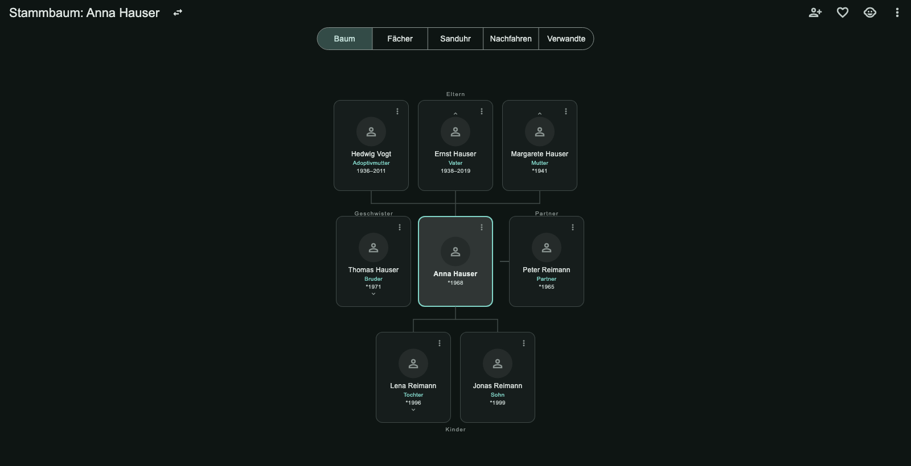
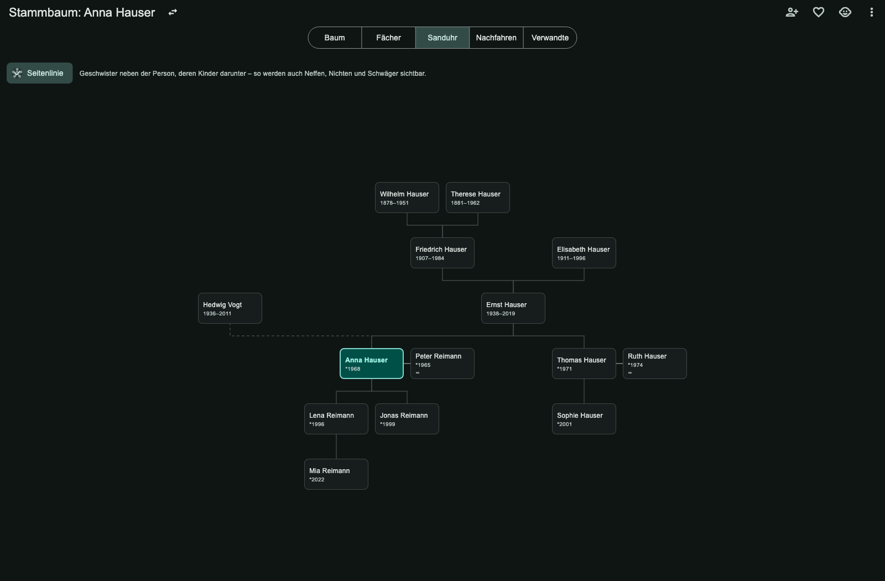
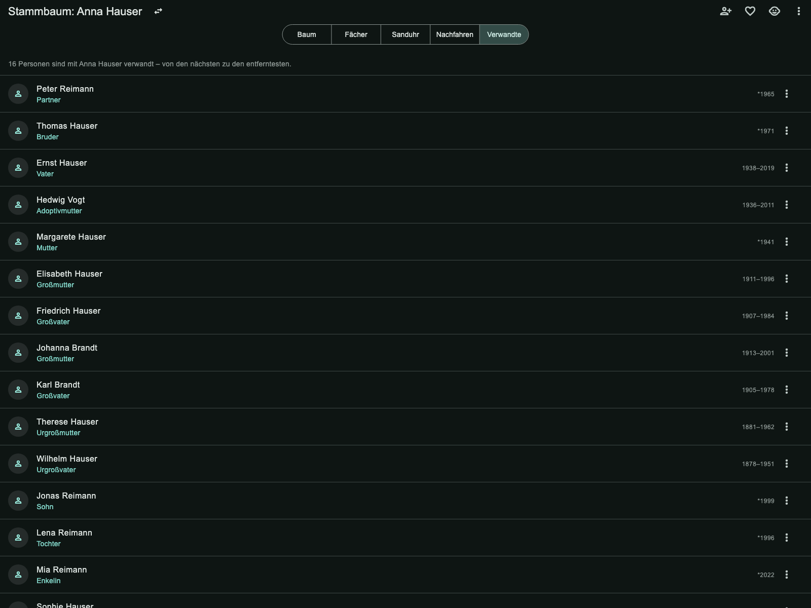

# Photo Vault

**Deine Fotobibliothek bleibt auf deinem Rechner.** Eine eigenständige
Foto- und Videoverwaltung für **macOS, Linux und Windows** – mit
Gesichtserkennung, Bildsuche in natürlicher Sprache und RAW-Entwicklung,
aber **ohne Server, ohne Konto und ohne Cloud-Dienst**.

Inspiriert von Immich, digiKam und Lightroom. Der Unterschied: Es gibt
nichts, wo deine Fotos hochgeladen werden könnten. Die Datenbank ist eine
SQLite-Datei, die Fotos liegen als normale Dateien daneben, und sämtliche
KI-Funktionen laufen lokal über quelloffene Modelle, die du bei Bedarf in
der App herunterlädst. Ausgeliefert wird kein einziges Modell mit.

```
Keine Cloud · Keine Telemetrie · Keine Registrierung · Alles offline
```

Die App macht genau drei Arten von Netzwerkaufrufen: den Download der
KI-Modelle bzw. Geodaten, den du selbst anstößt; das Laden der
Kartenkacheln in der Karten- und der Geländeansicht; und – nur wenn du
den Überflug über eine Aktivität öffnest – eine Abfrage nach Gipfeln,
Hütten und Quellen im gezeigten Ausschnitt. Nichts davon trägt ein Foto,
ein Konto oder eine Kennung mit.

## Bildschirmfotos

| Timeline | Entwickeln |
|---|---|
|  |  |

| Karte | Personen |
|---|---|
|  |  |

Der Stammbaum, in drei seiner sechs Sichten:



Eltern oben, Kinder unten, Geschwister und Partner daneben. Unter jedem
Namen steht, wie die Person zur Mitte gehört – ausgerechnet, nicht
eingetippt. „Adoptivmutter" ist eine eigene Art der Verbindung.



Die Sanduhr zeigt Vorfahren und Nachkommen in einem Bild. Mit
eingeschalteter **Seitenlinie** stehen Geschwister daneben und deren
Kinder darunter – so werden auch Neffen, Nichten und Schwäger sichtbar.
Die gestrichelte Linie führt zur Adoptivmutter.



Eingetragen werden nur Eltern, Kinder und Partner. Urgroßvater,
Adoptivmutter, Enkelin und Nichte rechnet die App daraus aus.

Die vier ersten Aufnahmen zeigen ausschließlich **gemeinfreie** Fotos aus
einer Demo-Bibliothek (NASA, National Archives, historische Aufnahmen) –
nie Bilder aus einer echten Sammlung. Auf den drei Stammbaum-Bildern ist
überhaupt kein Foto zu sehen; die gezeigte Familie ist frei erfunden. Wie
beides sichergestellt wird, steht in
[docs/screenshots/](docs/screenshots/).

## Herunterladen

Fertige Fassungen liegen unter [Releases](../../releases) – für alle drei
Plattformen:

| | Paket | Voraussetzung |
|---|---|---|
| **macOS** | Universal Binary, nativ auf Apple Silicon **und** Intel | ab macOS 14.0 |
| **Linux** | Flatpak-Bündel | flatpak |
| **Windows** | Verzeichnis zum Auspacken | Windows 10/11, x64 |

Die macOS-Mindestversion gibt nicht die App vor, sondern das Paket, über
das die KI-Modelle laufen (`flutter_onnxruntime` verlangt macOS 14.0). Der
eigene native Code kommt mit älteren Fassungen zurecht und schaltet
Einzelfunktionen ab, wo eine Schnittstelle fehlt.

### Linux

```bash
flatpak remote-add --if-not-exists --user flathub \
    https://dl.flathub.org/repo/flathub.flatpakrepo
flatpak install --user PhotoVault-*-x86_64.flatpak
flatpak run com.example.PhotoVault
```

Die GNOME-Laufzeit zieht Flatpak beim ersten Mal selbst nach. Das Bündel
bringt alles mit, was die App an Werkzeugen braucht – auch den
HEVC-Dekoder, ohne den HEIC-Fotos unsichtbar blieben und den manche
Distribution nicht mitliefert.

### macOS

Die App ist **nicht von Apple beglaubigt** (das erfordert ein
kostenpflichtiges Entwicklerkonto). macOS blockiert sie deshalb beim ersten
Start. So wird sie trotzdem geöffnet:

1. `Photo Vault.app` nach `/Programme` ziehen
2. Rechtsklick auf die App → **Öffnen** → im Dialog erneut **Öffnen**

Die Anwendung läuft mit **Hardened Runtime** und ignoriert damit
eingeschleuste Bibliotheken – trotz fehlender Beglaubigung.

Nur beim ersten Start nötig. Alternativ im Terminal:

```bash
xattr -dr com.apple.quarantine "/Applications/Photo Vault.app"
```

Wer das nicht möchte, baut die App selbst – siehe
[Aus dem Quellcode bauen](#aus-dem-quellcode-bauen).

### Windows

Archiv auspacken, `photo_vault.exe` starten. Es gibt bewusst kein
Installationspaket – nichts wird in die Registrierung geschrieben, nichts
verteilt sich über das System.

Beim ersten Start meldet sich SmartScreen, weil die Anwendung nicht
signiert ist (auch das erfordert ein kostenpflichtiges Zertifikat). Über
**Weitere Informationen → Trotzdem ausführen** startet sie.

Damit sie im Startmenü auftaucht, liegt `Verknuepfung-anlegen.cmd` bei –
ein Doppelklick genügt. Wird der Ordner später verschoben, muss die
Verknüpfung neu angelegt werden.

Alles, was die App für iPhone-Fotos, RAW und Video braucht, liegt im
Archiv. Windows böte für HEIC zwar eine eigene Schnittstelle an, öffnet
damit aber nur, wer die HEVC-Erweiterung im Store kauft – eine
Fotoverwaltung, die iPhone-Fotos erst nach einem Kauf anzeigt, ist keine.

### Für alle

Zu jedem Release gehört eine `SHA256SUMS.txt`. Prüfsumme des Downloads
vergleichen:

```bash
shasum -a 256 PhotoVault-*-macos-universal.zip   # macOS
sha256sum  PhotoVault-*-x86_64.flatpak           # Linux
certutil -hashfile PhotoVault-*-windows-x64.zip SHA256   :: Windows
```

Die App enthält **keine** KI-Modelle – die lädst du bei Bedarf in den
Einstellungen. Das hält den Download klein und macht nachvollziehbar,
welche Modelle aus welcher Quelle stammen.

## Plattformen

| Plattform | Status |
|---|---|
| macOS | vollständig unterstützt |
| Linux | unterstützt, als Flatpak – vier Entwickeln-Regler fehlen, siehe unten |
| Windows | unterstützt, als Archiv – dieselben vier Regler fehlen |
| iOS / Android | Code läuft grundsätzlich, aber nicht angepasst oder getestet |

**Es gibt keine Neben-Plattform.** Bibliothek, Entwickeln, Gesichter,
Texterkennung, Bildbeschreibung, Objektentfernung, Videoschnitt und
-wiedergabe laufen überall. Wo etwas anders ist, steht es unter
[Bekannte Grenzen](#plattformen) – vollständig, nicht ausgewählt.

Was ausserhalb von macOS anders gelöst ist, steht Phase für Phase in
[docs/plan_linux.md](docs/plan_linux.md) und
[docs/plan_windows.md](docs/plan_windows.md) – samt der Messwerte auf
echter Hardware.

## Funktionen

### Bibliothek & Organisation

- **Timeline** – alle Fotos/Videos chronologisch nach Monat gruppiert, mit
  Scrubber zum schnellen Springen
- **Entdecken** – Einstiegsseite mit Personen, Orten, zuletzt hinzugefügten
  Alben/Fotos und "Erinnerungen" (Fotos vom selben Tag früherer Jahre)
- **Kalender** – Jahresübersicht mit Titelbild und Foto-/Videoanzahl je Jahr
- **Karte** – Fotos mit GPS-Daten auf einer Karte (OpenStreetMap-Kacheln)
  oder wahlweise auf einem interaktiven 3D-Globus. Die dunkle Karte
  zeichnet dieselben OpenStreetMap-Kacheln umgefärbt – **ohne Anmeldung
  und ohne Schlüssel**; wer den feineren CARTO-Schnitt möchte, trägt
  unter *Einstellungen → Karte* einen eigenen Schlüssel ein
  (kostenlos und ohne Konto). Ausgeliefert wird keiner: Ein Schlüssel im
  Quelltext wäre für jeden lesbar, der das Verzeichnis öffnet. Dazu
  lokale Umkehr-Geokodierung; lokale Umkehr-Geokodierung
  (GPS → Stadt/Land) über den offenen GeoNames-Datensatz, komplett offline.
  Dicht beieinanderliegende Fotos werden zoomabhängig zu einem Marker
  zusammengefasst und rücken beim Hineinzoomen wieder auseinander. Beide
  Ansichten haben Zoomknöpfe; wo die Plattform es hergibt (**macOS und
  Windows**) auch einen Knopf auf den eigenen Standort – einmalig
  abgefragt, nur angezeigt, nicht gespeichert. Gemessen: macOS ±35 m,
  Windows ±19 m bei 15 m tatsächlicher Abweichung. Unter Linux fehlt der
  Knopf mit Absicht, siehe `docs/ortung.md`
- **Statistiken** – Anzahl Medien, Speicherplatz, Fotos/Videos pro Jahr,
  Saisonalität pro Monat, häufigste Kameras
- **Import** – Mehrfachauswahl über den nativen Dateidialog oder direkt von
  einer erkannten Kamera/SD-Karte (DCIM-Ordner); Duplikate werden per
  SHA-256-Prüfsumme automatisch übersprungen. **Kamera-Presets** legen pro
  Kamera-Modell automatisch Album/Tags/Favorit-Status beim Import fest
  (digiKam-Stil)
- **Alben & gespeicherte Suchen** – klassische Alben sowie "Intelligente
  Alben", die live die aktuellen Suchfilter statt einer festen Fotoliste
  festhalten
- **Favoriten, Sternebewertung (1–5) & Farbmarkierungen** (Lightroom-Stil),
  einzeln oder als Stapelaktion auf eine Auswahl
- **Tags & Volltextsuche** über Dateiname, Beschreibung, Tags, erkannten
  Text im Foto (OCR) sowie KI-Bildbeschreibung
- **Suche in ganzen Sätzen** – „unscharfe Fotos vom letzten Sommer ohne
  Ort" wird in die passenden Filter übersetzt, **ohne Sprachmodell**: Was
  verstanden wurde, steht als Marke unter dem Feld, und was nicht
  verstanden wurde, bleibt Volltext. Erreicht werden Zeitraum, Personen,
  Orte, Kamera, Bewertung, Farbmarkierung, Medienart, Schärfe, ISO und die
  Herkunft des Datums. Blende und Brennweite bleiben bewusst aussen vor:
  Bei „Blende 2,8" ist nicht entschieden, ob genau 2,8 oder „mindestens so
  offen" gemeint ist, und ein halbverstandener Wert liefert etwas anderes,
  ohne dass man es der Trefferliste ansieht
- **Ein geratenes Aufnahmedatum sagt, dass es geraten ist.** Trägt eine
  Datei kein Aufnahmedatum, fällt der Import auf den Zeitstempel der Datei
  zurück – der letzte Ausweg, und nach jedem Kopieren und Zurückholen der
  Zeitpunkt eben dieses Vorgangs. Bisher landete der geratene Wert in
  derselben Spalte wie ein gemessener, und ab da konnte kein Bildschirm
  die beiden unterscheiden: Die Zeitleiste stellte eine halbe Kindheit auf
  einen Abend, und die Serienerkennung fand eine „Serie" mit
  neunhundert Mitgliedern. Ein geschätztes Datum steht jetzt als solches
  im Infoblatt und in der Liste, bleibt aus Erinnerungen und Serien
  heraus und lässt sich gezielt suchen. **Die Marke wird nicht geraten** –
  statt einer SQL-Regel über alles, was auf einer vollen Stunde liegt,
  sieht ein Durchgang in jeder Datei nach
- **Zeitzone aus der Datei** – der Aufnahmezeitpunkt bleibt die Ortszeit
  der Kamera, denn das ist die Zeit, an die man sich erinnert; der Versatz
  sagt nur dazu, in welcher Zone sie galt. Ein geschriebenes `+00:00`
  wird nicht geglaubt, wenn das Foto in einer Zone liegt, die nie UTC+0
  ist – das ist die Werkseinstellung einer nie gestellten Kamera
- **Familienstammbaum** (eigener Menüpunkt, ⌘0) – wer zu wem gehört, als
  eigene Angabe neben den erkannten Gesichtern: Eltern, Kinder und Partner,
  dazu Geburts- und Sterbedatum sowie – nur für die Bezeichnungen –
  optional das Geschlecht. Sechs Sichten auf dieselbe Familie:
  – **Zierbaum**: die unmittelbare Verwandtschaft räumlich angeordnet,
    ein Klick rückt eine Person in die Mitte. Gezeichnet als Baum mit
    sich verjüngenden Ästen, Ranken und dem Familiennamen unten – in
    zwei Farbsätzen (Gold auf Dunkel, Bronze auf Pergament) und mit
    mitgelieferten Schriften (EB Garamond und Great Vibes, beide OFL).
    Die Äste sind keine Verzierung: Jeder ist eine Eltern-Kind-Kante,
    und ein Schwager hängt am Haushalt **seiner** Frau. Lässt sich als
    PDF ausgeben
  – **Fächer**: bis zu vier Generationen Vorfahren als Ringe. Ein Platz im
    Ring hat immer genau einen Nachfolger nach innen – deshalb kann hier
    keine Linie mehrdeutig werden, und deshalb zeigt der Fächer
    ausschließlich Vorfahren. Hinter der letzten belegten Generation steht
    ein Ring gestrichelter Plätze als Einladung, weiterzugehen
  – **Sanduhr**: Vorfahren und Nachkommen über je drei Generationen in
    einem Bild; jeder Vorfahr steht über seinem eigenen Kind. Mit
    zuschaltbarer **Seitenlinie** stehen Geschwister daneben und deren
    Kinder darunter – erst dadurch werden Neffen, Nichten und Schwäger
    hier sichtbar
  – **Nachfahren**: alle Nachkommen als eingerückte Gliederung
  – **Verwandte**: *alle* Verwandten mit ihrer Bezeichnung, sortiert von
    den nächsten zu den entferntesten
  – **Zeitleiste**: eine Zeile je Person auf einer gemeinsamen Achse. Die
    einzige Ansicht, die **Gleichzeitigkeit** zeigt – wer sich überlappte,
    wer sich um wenige Jahre verpasst hat

  Neben leiblichen Eltern lassen sich **Adoptiv- und Pflegeeltern**
  eintragen; sie zählen überall als Eltern, werden gestrichelt gezeichnet
  und eigens benannt. Die Art einer bestehenden Verbindung lässt sich
  nachträglich ändern, ohne sie zu lösen und neu zu legen. Jede Person hat
  einen **Lebenslauf** – Hochzeit, Umzug, Beruf, Ausbildung, jeweils mit
  Datum, Ort und Notiz.

  Gespeichert werden nur Eltern, Kinder und Partner. **Vierzehn weitere
  Grade** lassen sich trotzdem direkt eintragen – Großelternteil,
  Urgroßelternteil, Enkelkind, Urenkelkind, Geschwisterkind,
  Halbgeschwisterkind, Onkel/Tante, Neffe/Nichte, Cousin/Cousine,
  Schwiegerelternteil, Schwiegerkind, Schwager/Schwägerin,
  Stiefelternteil, Stiefkind. Sie werden an der richtigen Zwischenperson
  eingehängt, statt dass man erst dorthin rücken muss; wo die Stelle nicht
  eindeutig ist (wessen Elternteil?), wird gefragt statt geraten. Grade,
  denen noch eine Zwischenperson fehlt, stehen grau da und nennen den
  Grund – ein Cousin braucht zuerst einen Onkel.

  Die Probe darauf ist die Gegenrechnung: Wer einen Neffen einträgt, muss
  hinterher von der Bezeichnungslogik auch als Neffe ausgewiesen werden.
  Für alle vierzehn Grade ist das ein Test.

  Dazu vier Wege nach draußen: **Fotos der Familie** (alle Bilder, auf
  denen jemand aus dem Verwandtschaftsnetz erkannt wurde), **Orte der
  Familie** (dieselben Fotos auf der Karte, eingefärbt nach
  Verwandtschaftsrichtung), eine **Tafel als PDF** zum Aufhängen und ein
  **GEDCOM-Export** (5.5.1). Angehörige lassen sich anlegen, wenn kein
  einziges Foto von ihnen in der Bibliothek liegt
- **Papierkorb** – in den Papierkorb verschieben, ansehen,
  wiederherstellen, endgültig löschen; automatische Leerung nach
  konfigurierbarer Frist. Zu erreichen über *Einstellungen →
  Papierkorb*, neben seiner eigenen Einstellung – wie der gesperrte
  Ordner auch. (Bis Fassung 2.2.1 war der Bildschirm dafür zwar
  vollständig gebaut, aber von keiner Stelle aufgerufen: Gelöschte
  Fotos lagen in einem Behälter, den niemand öffnen konnte.)
- **Integritätsprüfung** – findet fehlende Dateien (Original, Vorschau,
  Thumbnail, Entwicklung, Video-Trim, Restaurierung) und optional per
  Prüfsumme veränderte Originale; verwaiste DB-Einträge lassen sich direkt
  bereinigen, verwaiste **Dateien** ohne DB-Zeile wahlweise einzeln oder
  alle auf einmal

### Orte, Reisen und Familie

- **Weltkarte** – nicht die Fotokarte, sondern die Übersicht: welche Länder
  und Regionen besucht sind, welche geplant. Ein Klick malt das Land aus;
  die Umrisse kommen aus einer mitgelieferten Datei (1,1 MB, aus
  [Natural Earth](https://www.naturalearthdata.com) gebaut), nicht aus dem
  Netz. Die drei Zustände unterscheiden sich nicht nur im Farbton, sondern
  auch im Strichmuster des Randes – sonst wären es für einen
  Rotgrünblinden drei gleiche Flächen.
- **Ort von Hand setzen** – über einen Klick auf die Karte **oder über
  den Namen**: „Goslar" weiss man, 51,9° N / 10,4° O nicht. Für alles, was
  ohne GPS ankommt – eingescannte Bilder, Kameras ohne Empfänger, Fotos
  von anderen Leuten. Gibt es den Namen mehrfach, nennt die Antwort die
  Zahl der übrigen: „Springfield" existiert in den USA über zwanzig Mal,
  und eine Koordinate ohne diesen Hinweis sähe aus wie eine Tatsache.
- **Ort von den Nachbarn erben** – wer die Kamera ohne Empfänger dabei
  hatte, bekommt einen Vorschlag aus den Aufnahmen davor und danach. Der
  Wert liegt nicht im Finden, sondern im **Schweigen**: Gezählt wird, ob
  *alle* Nachbarn im Zeitfenster am selben Ort waren. Wer am selben
  Nachmittag in Hannover und in Hamburg fotografiert hat, bekäme sonst für
  alles dazwischen den Ort, der zeitlich zufällig näher lag. Als Vorschlag
  mit seiner Begründung, nie als stille Eintragung; ein übernommener Ort
  bleibt als geerbt gekennzeichnet
- **Ortsansicht** – ein Bildschirm für Land, Region und Ort, dreimal
  derselbe: Flagge und Zahlen im Kopf, darunter die nächste Ebene zum
  Weiterklicken, darunter die Fotos. Die Liste führt **auch das
  Unbesuchte** – eine Liste, die nur zeigt, wo man war, ist ein Spiegel
  der eigenen Fotos; erst mit den übrigen wird sie eine Landkarte.
- **Globus** – dieselben Punkte auf einer drehbaren Kugel, mit
  Geländeschattierung.
- **Reisen** – **vorgeschlagen statt verlangt**: Die App findet
  zusammenhängende Zeiträume fern von zu Hause selbst und fragt nach, statt
  ein leeres Formular hinzustellen. Dazu ein Reisetagebuch mit Kapiteln je
  Tag und einer Route über die Aufnahmeorte. **Von Hand geht es auch** –
  ein Vorschlag erkennt naturgemäss nur, was Fotos hergeben, und wer eine
  Woche ohne Kamera unterwegs war, soll die Reise trotzdem eintragen
  können. Angegeben wird der Zeitraum, die Bilder darin kommen mit.
  Die Übersicht zeigt Reisen und Aktivitäten als **Kacheln mit
  Titelbild, Zeitraum und Ort** – „Florenz, Toskana, Italien · 4 weitere
  Orte". Der Ort steht dabei nicht an der Reise, sondern an ihren
  Aufnahmen; er wird für alle Einträge in einer einzigen Abfrage
  zusammengelesen, und genannt wird der häufigste. Unverortete Aufnahmen
  verdrängen ihn nicht, und trug keine einen Ort, bleibt die Zeile leer
  statt „Unbekannt" zu behaupten.
- **Aktivitäten** – dasselbe eine Stufe kleiner: Wanderungen, Radtouren,
  Ausflüge, Besichtigungen, Bootsfahrten. Eine Aktivität steht für sich
  und kann zu einer Reise gehören; die Sonntagswanderung vor der Haustür
  braucht keinen Urlaub. Die Art wird nur **nach oben** behauptet – aus der
  Luftlinie zwischen zwei Fotos folgt sauber einzig „schneller als
  25 km/h heisst Fahrzeug"; nach unten wird der harmloseste Fall gewählt.
- **GPX-Spuren** – eine aufgezeichnete Spur bleibt: als Linie über der
  Foto-Route und als **Höhenprofil über der Strecke** (nicht über der Zeit,
  denn dort wird jede Rast eine Ebene und jeder Abstieg eine Wand). Auf-
  und Abstieg werden zweistufig gerechnet – erst geglättet, dann eine
  Schwelle von fünf Metern; die Schwelle allein reicht nicht, weil sie
  gegen den Abstand zweier Messungen wirkt und der beim Rauschen doppelt
  so gross ist wie dessen Ausschlag.
- **Gelände in drei Dimensionen** – zu einer Spur die Landschaft, ein
  **Luftbild** darauf, die Spur darüber. Sie zeigt etwas, das weder Karte
  noch Profil zeigt: *wo im Gelände* der Weg verläuft. Die Fläche zerfällt
  in Blöcke, und jeder holt seine Textur in der Stufe, die zu seiner
  Entfernung passt – nah 0,4 m je Bildpunkt statt der 5,9 m, die eine
  einzige Textur über den ganzen Ausschnitt hergäbe. Darüber lassen sich
  Wanderwege, Strassen und Ortsnamen einzeln zuschalten; **Höhenlinien
  rechnet die App selbst** aus dem Höhengitter (Marching Squares), was
  keinen einzigen Kachelabruf kostet und auf jeder Stufe scharf bleibt.
  Gipfel, Hütten und Quellen stehen als Schilder im Gelände, mit einer
  Sichtprüfung entlang der Blickachse – sonst schwebte ein Gipfelname
  durch den Berg davor. Ohne neue Abhängigkeit gebaut: gezeichnet wird
  mit `Canvas.drawVertices`, die Höhen kommen als freie terrarium-Kacheln
  von AWS Open Data.
- **Kameraflug mit Dramaturgie** – statt selbst zu drehen lässt sich die
  Kamera die Spur entlang fliegen: Sie folgt dem Weg in Blickrichtung,
  Höhe, Tempo und Steigung laufen mit. Der Flug beginnt mit einem Einflug
  aus der Übersicht und endet mit den Zahlen der Tour; unterwegs tauchen
  **die eigenen Fotos an der Stelle auf, an der sie entstanden sind**, und
  blenden wieder weg. Anhalten, Tempo ändern und an jede Stelle springen
  geht während des Flugs.
- **Der Überflug als Video** – zum Weitergeben an Leute, die die App nicht
  haben. Auflösung und Länge werden gefragt, nicht vorgegeben. Höhe, Tempo
  und Steigung stehen dabei **im Bild** und nicht darunter: Was aus der
  App herausgeht, ist die Leinwand und sonst nichts. Jedes Fach ist so
  breit wie die breiteste Fassung, die sein Wert im Lauf dieses Fluges
  annimmt – ein Fach, das mit seinem Inhalt wächst, verschöbe dreissigmal
  in der Sekunde alles rechts davon. Geschrieben wird über AVFoundation
  (macOS) bzw. das mitgelieferte ffmpeg (Linux, Windows), und zwar als
  rohe Bildpunkte durch `stdin` statt über tausend Einzeldateien.
- **Familienstammbaum** – fünf Ansichten (Baum, Fächer, Sanduhr,
  Nachfahren, Liste) plus **Zeitleiste** und **Familienstatistik**.
  Adoptiv- und Pflegekanten sind eigene Arten, es gibt eine Kreisprüfung
  und einen Verwandtschaftsrechner. **GEDCOM 5.5.1 in beide Richtungen** –
  wer schon geforscht hat, muss nichts abtippen. Ereignisorte aus dem
  Lebenslauf landen auf Karte und Globus.
- **Standort** – ein Knopf setzt den eigenen Ort, auf allen drei
  Plattformen nativ. Die Genauigkeit kommt dabei aus der Datenbank hinter
  dem Dienst, nicht aus der Bibliothek.

### KI-Funktionen (alle offline, ONNX Runtime)

- **Gesichtserkennung & -clustering** – **YuNet** (Detektion) + **SFace**
  (Embedding), beide aus [OpenCV Zoo](https://github.com/opencv/opencv_zoo)
  (Apache-2.0). Unzugeordnete Gesichter werden per Union-Find-Clustering zu
  Gruppen vorgeschlagen (inkl. Vorschlag, welche bereits benannte Person es
  sein könnte); "Ähnliche mit auswählen" vergleicht jedes unbenannte Gesicht
  gegen das jeweils ähnlichste bereits ausgewählte Referenzgesicht
  (einstellbare Schwelle). Personen lassen sich zusammenführen, falls die
  Erkennung dieselbe reale Person zweimal angelegt hat. Ein einzelnes
  Gesicht lässt sich beiseitelegen; ein **ganzes Foto** lässt sich von der
  Suche ausnehmen – für Bilder, auf denen jeder Durchlauf neue „Gesichter"
  findet: eine Gemäldewand im Hintergrund, ein Zeitungsfoto, ein Plakat.
  Bereits erkannte Gesichter bleiben dabei stehen; die Ausnahme gilt dem
  Suchen, nicht dem Gefundenen.
- **KI-Bildsuche** – natürlichsprachige Suche ("Sonnenuntergang am Meer")
  über **CLIP ViT-B/32** (OpenAI-Originalgewichte, MIT-Lizenz)
- **KI-Bildbeschreibung** – automatische (englische) Bildunterschrift pro
  Foto über **Florence-2**, fließt in die Volltextsuche mit ein und wird auf
  Wunsch ins Deutsche übersetzt. Liest dabei auch Schrift im Bild
  (Ladenschilder, Ortstafeln). An 40 echten Fotos gegen den Vorgänger
  ViT-GPT2 beurteilt: 27 statt 11 zutreffende Sätze
- **KI-Tagging** – automatisches Zuordnen deutscher Alltagsbegriffe per
  CLIP-Zero-Shot-Klassifikation gegen eine feste Begriffsliste, statt eines
  zusätzlichen dedizierten Tagging-Modells. Der Begriff geht dabei in einer
  Satzschablone („a photo of …") und in einer von Hand geprüften englischen
  Fassung an den Encoder – gemessen der Unterschied zwischen F1 0,16 und
  0,48
- **KI-Objektmasken** – **SAM (Segment Anything) ViT-Base**: Vordergrund-/
  Hintergrund-Punkte setzen, Modell schlägt eine Maske vor, für gezielte
  Anpassungen nur auf einem Bildbereich im Entwickeln-Screen. Ergänzend
  **editierbare Vektor-Masken** (Freihand, Ellipse, Verlauf), die im
  Gegensatz zur KI-Maske später wieder verändert werden können
- **KI-Restaurierung** – **Real-ESRGAN x4** skaliert ein Foto um Faktor 4
  hoch und entrauscht es dabei. Läuft je nach Fotogröße mehrere Minuten und
  deshalb in einer **Hintergrund-Warteschlange**: anstoßen, in der App
  weiterarbeiten, Fortschritt jederzeit einsehbar. Die Warteschlange
  übersteht auch einen App-Neustart; das Original bleibt unverändert
- **Objektentfernung** – **LaMa** füllt eine übermalte Stelle mit dem,
  was dahinter plausibel ist: Mülleimer, Stromleitung, fremder Kopf am
  Bildrand. Der Pinsel arbeitet auf dem Original, das Ergebnis bleibt
  nicht-destruktiv
- **Serienvergleich** – bei einer Serie stehen dieselben Gesichter
  spaltenweise nebeneinander, statt ganze Fotos zu vergleichen. Auf einem
  Gruppenbild sieht man nicht, wer blinzelt; auf den Ausschnitten sofort.
  Je Kopf die gemessene Schärfe und „Augen offen", und ein Rahmen um die
  Aufnahme mit dem schärfsten Gesicht – ein Vorschlag, keine Entscheidung
- **Geschlossene-Augen-Erkennung** – **OCEC**-Modell markiert beim Sichten
  Fotos, auf denen mindestens ein Gesicht die Augen geschlossen hat –
  hilfreich beim Aussortieren von Blinzlern aus Porträt-/Gruppenserien
- **Unschärfe-Erkennung** – Laplace-basierter Schärfe-Score, z.B. zum
  Aussortieren verwackelter Serienbilder
- **Duplikate & ähnliche Fotos** – gruppiert Fotos mit sehr ähnlichen
  CLIP-Bild-Embeddings; **Serien-/Stapel-Erkennung** gruppiert zusätzlich
  nach visueller Ähnlichkeit UND zeitlicher Nähe (z.B. Serienbilder derselben
  Szene)
- **Modell-Verwaltung in der App** – unter Einstellungen lädst du alle
  benötigten Modelldateien direkt aus offiziellen Open-Source-Quellen
  (GitHub/HuggingFace) herunter. Es wird nichts mit der App selbst
  ausgeliefert; ohne Download laufen alle anderen Funktionen trotzdem
  normal, nur eben ohne die jeweilige KI-Funktion.

### RAW & Bildbearbeitung

- **Erweiterte RAW-Unterstützung** – alle Hersteller-RAW-Formate (nicht nur
  DNG), die macOS über ImageIO/CIRAWFilter beziehungsweise LibRaw unter
  Linux kennt
- **Nicht-destruktive Entwicklung** (Develop-Screen) – Anpassungen
  (Belichtung, Kontrast, Objektivkorrektur über CIRAWFilter, Masken-basierte
  gezielte Korrekturen) werden als Verlauf gespeichert, das Original bleibt
  unverändert; jeder Schritt lässt sich zurückverfolgen. Ausserhalb von
  macOS rechnet derselbe Fragment-Shader, der auch die Live-Vorschau
  zeichnet, das gespeicherte Ergebnis
- **Tonwertkurve** – Punktkurve mit den Kanälen RGB, R, G und B; Punkte per
  Ziehen setzen und verschieben, langes Drücken entfernt sie. Monotone
  Interpolation nach Fritsch–Carlson, damit die Kurve zwischen zwei Punkten
  nicht überschwingt.
- **Farbmischer** – acht Farbbänder (Rot bis Magenta) mit je Farbton,
  Sättigung und Helligkeit, wie in Lightroom und darktable
- **Histogramm** im Entwickeln-Screen, umschaltbar zwischen **Helligkeit**
  (Luma-gewichtet) und **RGB** (die drei Kanäle additiv überlagert) –
  aktualisiert sich live zu den Reglern
- **Bildeditor** für nicht-RAW-Fotos
- **Video-Zuschnitt** – nicht-destruktiver Start-/Endpunkt-Schnitt über
  AVFoundation, Ergebnis als separate Datei, Original bleibt erhalten
- **Live Photos** – automatische Verknüpfung von Foto + Video bei
  gleichem Dateinamen; in der Vollbildansicht gedrückt halten spielt das
  Video ab (wie Apples Fotos-App)
- **Panorama- & 360°-Fotos** – breite Panoramen werden in der Vollbildansicht
  automatisch bildfüllend gezeigt. Als equirechteckig (360°) erkannte Fotos
  bekommen eine eigene Ansicht mit drei umschaltbaren Modi: **3D-Kugel**
  (Umschauen aus dem Kugelmittelpunkt), **flaches Schwenken** und die
  unveränderte Originalvorschau
- **Videos nehmen an allem teil** – jedes Video bekommt beim Import ein
  Standbild in 2048 Punkten als *Vorschau*, nicht nur als Miniatur. Da
  jede Auswertungsstufe auf die Vorschau schaut, bekommen Videos damit
  Bildbeschreibung, Schlagwörter, Gesichter, Texterkennung und
  KI-Bildsuche – ohne dass eine einzige Stufe etwas von Videos wissen
  muss. Ihr Ort kommt aus dem `moov`-Kasten der Datei.
  **Ab zehn Sekunden Laufzeit reicht ein Standbild nicht** – dann werden
  bis zu fünf über die Länge verteilte Bilder ausgewertet. Bei einem
  Live-Photo-Fetzen von zwei Sekunden ist das eine Bild das ganze Video;
  bei neun Minuten wäre es eine Stichprobe von 0,2 Promille, und wer den
  Hund im Video sucht, fände ihn nur, wenn er zufällig in der ersten
  Sekunde ins Bild lief. Die Bilder werden nicht aufgehoben, und in der
  Suche zählt das **beste** – ein Mittelwert über verschiedene Szenen
  wäre ein Vektor, der zu nichts mehr recht passt
- **Farbraum bleibt erhalten** – Vorschau, Miniatur und Export tragen ihr
  Profil bei sich, **Display P3** dort, wo die Aufnahme mehr als sRGB
  hergibt. Was davon noch offen ist, steht unter
  [Funktionale Grenzen](#funktionale-grenzen)
- **XMP-Sidecar-Export und -Import** – Metadaten (Bewertung, Tags,
  Beschreibung) im Lightroom/darktable/digiKam-kompatiblen Format
  exportieren; beim Einlesen zeigt die App zuerst alle Abweichungen zum
  aktuellen Stand an und übernimmt sie einzeln oder gesammelt

### Sicherheit & Datenschutz

- **Gesperrter Ordner** – PIN-geschützter Bereich mit echter
  Dateiverschlüsselung (AES-256-GCM, Envelope Encryption: ein zufälliger
  Master-Key verschlüsselt die Dateien, der PIN selbst verschlüsselt nur
  diesen Master-Key über Argon2id). Gesperrte, gelöschte Fotos landen in
  einem eigenen, ebenfalls PIN-geschützten Papierkorb – nicht im normalen.
  PIN-Wechsel erfordert keine Neuverschlüsselung aller Dateien.
  Jede verschlüsselte Datei ist zusätzlich als Ganzes gesichert: Jeder Block
  ist an seine laufende Nummer gebunden, ein Abschlussblock hält ihre Anzahl
  fest. Wird eine Datei gekürzt oder werden Blöcke vertauscht, fällt das beim
  Entschlüsseln auf, statt eine stillschweigend verkürzte Datei zu liefern.
  Dateien im vorherigen Format werden unverändert weiter gelesen.
- **Sperren räumt auch die Datenbank auf.** Die Datei zu verschlüsseln
  genügt nicht: Was das Programm aus dem Bild *errechnet* hat, stünde
  sonst weiter im Klartext daneben. Beim Sperren gehen deshalb der
  erkannte Text, die Bildunterschrift, der Bildsuche-Vektor und die
  Schlagwörter der Bilderkennung – alles wird nach dem Entsperren neu
  berechnet. Was **bleibt**, ist ausdrücklich das Eigene: der eigene
  Beschreibungstext, selbst vergebene Schlagwörter und die Zuordnung
  eines Gesichts zu einer Person. Jedes Schlagwort führt dafür seit
  Schema 56 mit, woher es stammt; eine Handvergabe wird nie zur
  KI-Vergabe erklärt, auch dann nicht, wenn die Bilderkennung denselben
  Begriff später vorschlägt.

  Eines bleibt bewusst liegen: die **Einbettung eines Gesichts**, rund
  512 Byte. Sie ist aus dem Bildinhalt abgeleitet und gehörte nach
  derselben Regel dazu — nur wurde sie aus einem an den Landmarken
  ausgerichteten Ausschnitt berechnet, und die Landmarken stehen nicht in
  der Zeile. Sie zu löschen hiesse, die Wiedererkennung für genau die
  gesperrten Fotos dauerhaft zu verschlechtern.
- **Hardened Runtime auf macOS** – die Anwendung ignoriert eingeschleuste
  Bibliotheken. Gemessen mit einer eigens gebauten Testbibliothek: ohne die
  Härtung lief fremder Code im Prozess mit, mit ihr nicht mehr. Die Prüfung
  „Library Validation" bleibt dabei aus – sie vergleicht
  Entwickler-Kennungen, und eine ad-hoc signierte Anwendung hat keine; jede
  mitgelieferte Bibliothek gälte als fremd und die Anwendung startete gar
  nicht.
- **Der Linux-Sandkasten lässt eine Menge aussen vor** – neben `~/.ssh`,
  `~/.gnupg` und dem Schlüsselbund auch `~/.var/app` (die Daten aller
  anderen Flatpaks, Passwortspeicher eingeschlossen), `~/.config`,
  `~/.pki`, `~/.aws`, `~/.kube`, `~/.docker` sowie Browser- und
  Mailprofile. Der Grund: Die Programmteile, die hier fremde Dateien
  auspacken – libheif, libde265, LibRaw –, sind ein beliebtes Ziel.
- **Manuelles Cloud-Backup** – kopiert neue Dateien (optional verschlüsselt
  mit einer Passphrase) in einen frei wählbaren Ordner (z.B. deinen
  Dropbox-/Google-Drive-Sync-Ordner) und wieder zurück. Geschrieben wird
  über eine Zwischendatei, damit ein Cloud-Programm nie eine halbfertige
  Datei zu sehen bekommt; passt sie dort nicht hinein (unter Flatpak fasst
  der Zwischenspeicher 789 MiB, Videos sind grösser), wird neben dem Ziel
  geschrieben. Eine Datei, die scheitert, bricht den Lauf nicht ab – sie
  gilt als nicht gesichert und wird gemeldet

### Bedienung

- **Zweisprachige Oberfläche – Deutsch und Englisch.** Umschaltbar unter
  Einstellungen → Sprache, wahlweise fest oder der Systemsprache folgend;
  der Wechsel wirkt sofort, ohne Neustart. Datum, Uhrzeit und
  Tausendertrennung richten sich mit. Beim Wechsel bietet die App an, das
  Schlagwort-Vokabular mitzuziehen – selbst hinzugefügte Begriffe bleiben
  dabei unangetastet.
- **Helles/Dunkles/System-Erscheinungsbild**, native macOS-Typografie
  (San Francisco über `.AppleSystemUIFont`)
- **Tastaturkürzel** – ⌘1–⌘9 für die Navigation, F (Favorit), ⌫ (Löschen mit
  Bestätigung), Escape/Leertaste im Vollbild-Viewer, "?" öffnet eine
  Übersicht aller Kürzel
- Einheitliches Design-Token-System für Abstände/Radien

## Aus dem Quellcode bauen

**Für die reine Nutzung nicht nötig** – dafür genügt der Download oben.
Weder das Flutter SDK noch Xcode müssen installiert sein; die
`Photo Vault.app`, das Flatpak und das Windows-Archiv laufen
eigenständig.

Dieser Abschnitt richtet sich an alle, die die App selbst bauen oder
weiterentwickeln möchten. Voraussetzung dafür:
[Flutter SDK](https://docs.flutter.dev/get-started/install)
(stabiler Kanal, ≥ 3.19).

```bash
cd photo_vault

# Plattformordner generieren (überschreibt NICHT den vorhandenen lib/-Ordner)
flutter create --platforms=macos,linux,windows,ios,android .

# Abhängigkeiten installieren
flutter pub get

# Datenbank-Code generieren (drift braucht das für die typisierten Queries)
dart run build_runner build --delete-conflicting-outputs

# Auf macOS starten
flutter run -d macos
```

### Linux

Vorher prüfen, ob die Maschine alles hat – das Skript nennt für jedes
fehlende Stück den Installationsbefehl:

```bash
tool/linux_setup_check.sh
flutter run -d linux
```

Gebraucht werden neben dem Flutter SDK die Kommandozeilenwerkzeuge, über
die HEIC, RAW und Video laufen: `heif-convert` (Paket `libheif-examples`,
**samt HEVC-Dekoder**), `dcraw_emu` (`libraw-bin`) sowie
`ffmpeg`/`ffprobe`; zum Bauen ausserdem `libmpv-dev` für die
Videowiedergabe. Fehlt ein Laufzeit-Werkzeug, bleibt die App benutzbar,
nur diese eine Fähigkeit fehlt.

Das Flatpak-Bündel, das die Werkzeuge in bekannten Fassungen mitbringt,
entsteht mit:

```bash
tool/flatpak_bauen.sh --installieren --pruefen
```

Bauplan und Metadaten liegen unter
[packaging/flatpak/](packaging/flatpak/).

### Windows

Gebraucht werden Visual Studio Build Tools mit der Arbeitslast
„Desktopentwicklung mit C++". Ob die Installation vollständig ist, sagt
`vswhere -all` – ohne `-all` verschweigt es unvollständige Installationen.

```powershell
tool\windows_werkzeuge.ps1     # holt heif-dec, dcraw_emu, ffmpeg ins Paket
tool\windows_bauen.ps1         # baut und schnuert das Archiv
```

`windows_werkzeuge.ps1` baut libheif selbst, statt ein Fertigpaket zu
nehmen: Die üblichen Fertigpakete bringen 63 MB Abhängigkeiten mit, von
denen die App vier braucht – der eigene Bau kommt auf 16 MB. Das Werkzeug
heisst dort `heif-dec`; unter diesem Namen hat libheif `heif-convert` mit
Fassung 1.18 abgelöst.

**Falls du schon eine Bibliothek mit älterer Version dieses Projekts hast:**
Das Datenbankschema hat sich seit den ersten Versionen mehrfach erweitert
(aktuell Schema-Version 78: Kamera-Presets, RAW-Entwicklung, Video-Trim,
Gesichts-Clustering, gesperrter Ordner, gespeicherte Suchen,
Erscheinungsbild-Einstellungen, Vektor-Masken, KI-Restaurierungs-
Warteschlange, Tonwertkurve und Farbmischer, gelernte
Wiedererkennungs-Schwellen, Sprachwahl, Export-Voreinstellungen,
ignorierte Gesichter, Klarheit/Vignettierung, importierte Farbtabellen,
Ortsmarken für Länder und Regionen, Reisen und Reisetagebuch,
Ereignisorte im Stammbaum, Aktivitäten, GPX-Spuren, Herkunft der
Schlagwörter, von der Gesichtssuche ausgenommene Fotos, eigener
CARTO-Schlüssel für die dunkle Karte, Hintergrundaufgaben,
Bewertungen, geprüfte Video-Orte, Reihen und Serienvergleich,
Kartenstil und Ebenen der Geländeansicht, Wanderobjekte, geschätzte und
geprüfte Aufnahmedaten, geerbte Orte samt verworfenen Vorschlägen,
Video-Einbettungen mehrerer Standbilder, Zeitzonenversatz, …). Drift
migriert das automatisch beim
ersten Start nach dem Update – es muss nichts manuell gelöscht werden,
vorhandene Fotos/Alben/Personen bleiben erhalten.

Kein Xcode-Handarbeit mehr nötig für die Gesichtserkennung: Sie läuft
komplett über ONNX Runtime (statt über Apples Vision-Framework).

### macOS-Entitlements (Datei-/Ordnerzugriff)

Die Netzwerkaufrufe der App sind die drei oben genannten – der
Modell-/GeoNames-Download, Kartenkacheln und die Abfrage der
Wanderobjekte für den Überflug. Alles andere ist rein lokal.

Damit die (sandboxte) macOS-App Ordner importieren und Backups an frei
gewählte Orte schreiben darf, müssen in
`macos/Runner/DebugProfile.entitlements` und `Release.entitlements`
folgende Einträge vorhanden sein (bei `flutter create` meist schon per
Default gesetzt):

```xml
<key>com.apple.security.files.user-selected.read-write</key>
<true/>
<key>com.apple.security.network.client</key>
<true/>
```

## KI-Modelle einrichten (in der App, nicht manuell)

**Einstellungen → KI-Modelle** zeigt für jedes Modell eine Karte mit
Download-Button:

| Modell | Zweck | Lizenz | Quelle |
|---|---|---|---|
| YuNet | Gesichtserkennung (Bounding Boxes) | Apache-2.0 | OpenCV Zoo |
| SFace | Gesichts-Embedding für Wiedererkennung/Clustering | Apache-2.0 | OpenCV Zoo |
| CLIP ViT-B/32 | KI-Bildsuche in natürlicher Sprache | MIT (OpenAI-Gewichte) | Xenova/HuggingFace |
| SAM ViT-Base | KI-Objektmasken für gezielte Entwicklungs-Anpassungen | Apache-2.0 (Meta Segment Anything) | Xenova/HuggingFace |
| Florence-2 base-ft | Automatische Bildbeschreibung (Englisch), liest auch Schrift im Bild | MIT (Microsoft) | onnx-community/HuggingFace |
| OCEC | Erkennung geschlossener Augen (Blinzler) | MIT | PINTO0309/GitHub |
| Real-ESRGAN x4 | KI-Restaurierung (4× hochskalieren + entrauschen) | BSD-3-Clause | SceneWorks/HuggingFace |
| OPUS-MT en→de | Bildbeschreibungen in die Oberflächensprache übersetzen | Apache-2.0 (Helsinki-NLP) | Xenova/HuggingFace |
| OPUS-MT de→en | Deutsche Suchanfragen und Schlagwörter für die Bildsuche übersetzen | Apache-2.0 (Helsinki-NLP) | Xenova/HuggingFace |
| LaMa | Objektentfernung – Störendes wegretuschieren, die Lücke wird gefüllt | Apache-2.0 (Samsung Research), ONNX-Export von Carve | Carve/HuggingFace |
| PaddleOCR (latin PP-OCRv5) | Texterkennung in Fotos, zwei Modelle mit zusammen 13,7 MB. **Unter macOS nicht nötig** – dort erledigt das Apples Vision-Framework ohne Download | Apache-2.0 (PaddleOCR) | PaddlePaddle |

Ein Klick auf "Herunterladen" lädt die Dateien direkt von GitHub bzw.
HuggingFace in den `models/`-Ordner der App (der Pfad je Plattform steht
unter [Architektur](#architektur)) – kein manuelles Kopieren nötig.
Bricht ein Download ab, wird er beim nächsten Versuch **fortgesetzt**
statt neu begonnen, und jede Datei wird nach dem Laden gegen ihre
Prüfsumme gehalten. Bei den grösseren Modellen macht das den Unterschied
zwischen „nochmal 400 MB" und „die letzten zwei". Danach werden neu importierte Fotos automatisch
analysiert; die jeweilige Funktion schaltet sich in der UI automatisch
frei, sobald das Modell installiert ist. Ohne Download laufen alle anderen
Funktionen normal weiter.

Die genauen Quell-URLs stehen zentral in `lib/services/model_catalog.dart`
– falls HuggingFace/GitHub Pfade ändern, reicht es, sie dort anzupassen.

### Transparenz zu den technischen Risiken

Konkrete Bugs wurden durch echtes Testen (nicht nur Codelesen) gefunden
und behoben:

- CLIPs Text-Encoder (Xenova-Export) hat kein `attention_mask`-Eingabefeld –
  das wurde entfernt, nur `input_ids` wird noch übergeben.
- CLIPs Text-Encoder erwartet `int64`-Token-IDs, `flutter_onnxruntime` legt aus
  einer normalen Dart-`List<int>` aber `int32`-Tensoren an – behoben durch
  `Int64List.fromList(...)`.
- YuNet/SFace (Teil der OpenCV-DNN-Familie) erwarten **BGR**-Kanalreihenfolge,
  nicht RGB – das war der Hauptgrund, warum keine Gesichter erkannt wurden.

Zusätzlich lesen die Inferenz-Services die tatsächlichen Ein-/Ausgabenamen
dynamisch aus `session.inputNames`/`session.outputNames` statt sie zu raten,
und Ein-/Ausgabe-Tensorformen für SAM/Florence-2 wurden vor dem Einbau real
gegen die ONNX-Dateien verifiziert (Python `onnx`/`onnxruntime`) statt
angenommen.

Verbleibendes, geringeres Risiko: Die Gesichts-Ausrichtung vor dem
SFace-Embedding beschränkt sich auf einen einfachen Bounding-Box-Crop (keine
5-Punkt-Landmark-Warp wie im Original) – das kostet etwas
Wiedererkennungsgenauigkeit, ist aber kein Funktionsfehler. Die
KI-Bildbeschreibung liefert englischen Text – ein vergleichbar kleines
mehrsprachiges Modell gibt es nicht, die mehrsprachigen liegen im
Gigabyte-Bereich. Der Umweg über das Übersetzungsmodell ist ausgemessen:
Er liefert flüssiges Deutsch und kostet 0,07 s je Satz.

## Gesperrter Ordner (Verschlüsselung)

**Einstellungen → Gesperrter Ordner** richtet einen PIN ein. Danach lassen
sich einzelne Fotos aus der normalen Bibliothek in den gesperrten Ordner
verschieben; sie werden dabei mit AES-256-GCM verschlüsselt auf der
Festplatte abgelegt und sind ohne PIN weder in der Timeline noch über den
normalen Papierkorb sichtbar oder wiederherstellbar. Der Master-Key gilt
nach PIN-Eingabe für die laufende App-Sitzung; ein PIN-Wechsel verpackt nur
den Master-Key neu, ohne alle Dateien erneut verschlüsseln zu müssen.

## Werkzeuge (eigener Menüpunkt)

**Werkzeuge** bündelt manuelle Trigger für Aufgaben, die nicht automatisch
im Hintergrund laufen sollen:

- **Gesichter scannen** – *nur neue Fotos* oder *alle Fotos erneut* (z.B.
  nach einem Update der Gesichtserkennung; bereits zugeordnete Gesichter
  bleiben dabei erhalten), inkl. einstellbarer **Ähnlichkeitsschwelle** für
  "Ähnliche mit auswählen" im Personen-Tab
- **Nachträglich berechnen** – für Fotos, die vor Installation des jeweiligen
  Modells importiert wurden: CLIP-Embeddings, KI-Tags, Bildbeschreibungen,
  Text in Fotos (OCR), Unschärfe-Score
- **Duplikate & ähnliche Fotos suchen** – gruppiert Fotos mit sehr
  ähnlichen CLIP-Embeddings (Kosinus-Ähnlichkeit über einstellbarer
  Schwelle); byte-identische Duplikate werden dagegen bereits beim Import
  per Prüfsumme automatisch ausgeschlossen. Alle gegen alle zu vergleichen
  wäre quadratisch, deshalb läuft eine Vorfilterung über 32 zufällige
  Projektionen (eine Form von Locality-Sensitive Hashing). An einer
  gewachsenen Bibliothek gegen einen vollständigen Lauf gehalten: 41 von
  42 Gruppen
- **Serienbilder gruppieren** – gruppiert visuell ähnliche UND zeitlich nah
  beieinander aufgenommene Fotos zur Durchsicht. Hier ist die **Zeit** der
  Vorfilter, nicht die Ähnlichkeit: Eine Serie verlangt ohnehin höchstens
  30 Sekunden Abstand, und diese Bedingung ist exakt statt geschätzt
- **Unbewertete Fotos sichten** – geführtes Durchgehen noch nicht bewerteter
  Fotos (Culling)
- **Vorschaubilder neu erstellen** – *nur fehlende* oder *alle neu
  erstellen*, für HEIC/RAW-Fotos, die vor Einrichtung der nativen
  Bildkonvertierung importiert wurden; ebenso **entwickelte Fotos neu
  rendern**
- **Aufnahmedatum aus RAW-Fotos nachtragen** – liest Datum, Kamera und
  Objektiv direkt aus RAW-Dateien und sortiert die Fotos an die richtige
  Stelle, auch im Monatsordner auf der Platte. Der einzige
  Nachtrage-Lauf, der vorhandene Angaben ändert statt nur zu ergänzen,
  und deshalb der einzige mit Rückfrage
- **Orte & Kameradaten einlesen** – GPS aus den Fotos übernehmen, daraus
  Land/Bundesland/Stadt auflösen, Kameramodelle nachtragen und
  **Kamera-Presets** verwalten
- **Bibliotheks-Integritätsprüfung** – fehlende oder veränderte Dateien finden
- **XMP-Sidecars schreiben/einlesen** – Metadatenaustausch mit anderen
  Programmen in beide Richtungen
- **Live-Photo-Paare erneut prüfen** – für nachträglich zusammengeführte
  Foto-/Video-Bibliotheken

## Bildformat-Unterstützung (HEIC, RAW & Co.)

Flutter selbst (genauer: die Skia-Rendering-Engine) kann **HEIC/HEIF**
(Apples Standardformat für iPhone-Fotos) und **RAW-Formate** nicht
rendern – und das Dart-Paket `image`, das für Thumbnails verwendet wird,
kann sie ebenfalls nicht dekodieren. Ohne Gegenmaßnahme blieben solche
Fotos in der Timeline ohne Vorschaubild und ließen sich auch in der
Vollbildansicht nicht öffnen.

**Lösung auf macOS:** `macos/Runner/ImageConverter.swift` nutzt Apples
eigenes **ImageIO-Framework** (dieselbe Technik, die auch der Finder für
Vorschaubilder verwendet), um solche Dateien zu einer JPEG-Vorschau zu
konvertieren – einmalig beim Import, gespeichert unter
`previews/{assetId}.jpg`. Diese Vorschau wird für Thumbnail, Vollbildansicht
und Gesichtserkennung verwendet; das Originalformat bleibt unverändert in
`originals/` erhalten (wichtig für Backup-Treue). Dieselbe native
Komponente übernimmt außerdem den nicht-destruktiven Video-Zuschnitt
(AVFoundation) und die Objektivkorrektur für RAW-Import (CIRAWFilter).

**Lösung auf Linux und Windows:** Dieselben Aufgaben übernimmt
`lib/services/platform/desktop_image_tools.dart` über etablierte
Kommandozeilenwerkzeuge – `heif-convert` bzw. unter Windows `heif-dec`
für HEIC/HEIF, `dcraw_emu` für RAW, `ffmpeg`/`ffprobe` für Video. Eigene
FFI-Anbindungen an libheif, LibRaw und libavcodec zu bauen wäre der
aufwendigere Weg zum selben Ergebnis gewesen; für keine dieser
Bibliotheken gibt es ein brauchbares Dart-Paket. Im Flatpak wie im
Windows-Archiv sind die Werkzeuge mit im Paket.

**Der HEVC-Dekoder ist die Stolperstelle.** Manche Distribution liefert
libheif ohne aus: `heif-convert` öffnet die Datei dann zwar, kann den
Bildinhalt aber nicht auspacken. Das Flatpak kompiliert ihn deshalb fest
ein, statt ihn zur Laufzeit zu suchen; unter Windows wird libheif aus
demselben Grund selbst gebaut.

**Aufnahmewerte aus RAW-Dateien** gehen einen eigenen Weg. Die übliche
EXIF-Bibliothek liest nur TIFF- und JPEG-Strukturen – Canons **CR3** ist
aber ein ISO-BMFF-Container wie MP4 und liefert dort gemessen **null
Angaben**. Kamera und Objektiv blieben leer, und weil aus derselben
Quelle das Aufnahmedatum kommt, fiel auch das auf den Zeitstempel der
Datei zurück: In einer Bibliothek mit 909 CR3-Fotos lagen 891 Daten
falsch, 517 davon im falschen Monat.

Kommt aus einer RAW-Datei nichts, fragt die App deshalb das System bzw.
das mitgelieferte Werkzeug: **ImageIO** unter macOS, **`raw-identify`**
(LibRaw) unter Linux und Windows. An derselben Datei gegeneinander
gehalten liefern beide dieselben Werte; nur die Belichtungskorrektur
gibt `raw-identify` nicht aus. Für bereits importierte Fotos gibt es
**Werkzeuge → Aufnahmedatum aus RAW-Fotos nachtragen**.

**AVIF** liest dieselbe Bibliothek wie HEIC. Bis 1.9.0 wurden
AVIF-Dateien allerdings an den RAW-Entwickler weitergereicht, der sie
nicht öffnen kann – die Fotos blieben ohne Vorschau, obwohl der passende
Dekoder die ganze Zeit vorhanden war.

Status prüfbar unter **Werkzeuge → Vorschaubilder → HEIC/HEIF & RAW-
Unterstützung**. JPG/PNG/WebP/GIF/BMP/TIFF funktionieren immer, unabhängig
von diesen Komponenten.

## Manuelles Backup verwenden

**Einstellungen → Jetzt sichern** → Zielordner wählen (z.B. dein lokaler
Dropbox- oder Google-Drive-Sync-Ordner):

```
<Zielordner>/PhotoVault-Backup/
  originals/{yyyy}/{mm}/{assetId}.{ext}   (nur neue/noch nicht gesicherte Dateien)
  metadata.json                            (Favoriten, Beschreibungen, Tags,
                                            Alben, Bewertungen, Farbmarken, Orte)
```

**Fotos im gesperrten Ordner stehen dort nicht drin** – weder ihre Datei
noch ihr Name, ihre Beschreibung oder ihre Schlagwörter. Bis Fassung
2.2.0 wurden zwar ihre Dateien ausgelassen, ihre Metadaten aber
mitgeschrieben; in einem unverschlüsselten Backup in einem Cloud-Ordner
gab das genau preis, wovor der gesperrte Ordner schützen soll. **Was
eine frühere Sicherung bereits enthält, ändert das nicht** – im
Sicherungsziel wird nie gelöscht.

**Einstellungen → Wiederherstellen** → Backup-Ordner wählen: importiert alle
gefundenen Originaldateien (Duplikate werden über die Prüfsumme
übersprungen) und wendet `metadata.json` an. Personen/Gesichter werden
bewusst nicht mitgesichert – nach einer Wiederherstellung müssten Gesichter
erneut zugeordnet werden (die Erkennung selbst läuft aber automatisch
erneut, sobald das YuNet-Modell installiert ist).

## Architektur

```
lib/
  db/database.dart              drift-Schema (Assets, Albums, Tags, People, PersonBeziehungen,
                                 Faces,
                                 Embeddings, CameraPresets, DevelopSettings/-History/-Masks,
                                 VideoTrims, RestoreJobs, PrivacySettings, BackupRecords,
                                 AppSettings, …)
  services/
    storage_paths.dart          Ordnerlayout auf der Festplatte
    import_service.dart         Duplikaterkennung, Kopieren, Thumbnail, EXIF-Datum
    native_image_converter.dart  Dart-Wrapper für HEIC/RAW-Konvertierung, Video-Trim, Objektivkorrektur
    raw_formats.dart             Zentrale Liste der als RAW erkannten Dateiendungen
    model_catalog.dart           Liste der quelloffenen KI-Modelle + Download-URLs
    model_download_service.dart  Lädt Modelldateien mit Fortschrittsanzeige herunter
    face_engine_service.dart     YuNet-Detektion + SFace-Embedding (ONNX Runtime)
    face_clustering_service.dart Union-Find-Clustering unzugeordneter Gesichter
    clip_service.dart            CLIP-Inferenz (ONNX Runtime) + Kosinus-Suche
    segmentation_service.dart    SAM-Inferenz für KI-Objektmasken
    vector_mask_service.dart     Editierbare Vektor-Maskenformen (normalisierte Koordinaten)
    florence_captioning_service.dart
                                 Florence-2-Inferenz für KI-Bildbeschreibung
    bart_tokenizer.dart          Wortzerleger dafür (Byte-Level-BPE, BART-Art)
    ai_tagging_service.dart      CLIP-Zero-Shot-Tagging gegen feste Begriffsliste
    eye_state_service.dart       OCEC-Inferenz für geschlossene Augen
    restore_service.dart         Real-ESRGAN-Inferenz (KI-Restaurierung)
    restore_queue_service.dart   Hintergrund-Warteschlange dafür (übersteht App-Neustart)
    tile_processor.dart          Generisches Zerlegen/Zusammensetzen großer Bilder in Kacheln
    blur_detection.dart          Laplace-basierter Unschärfe-Score
    histogram.dart               Tonwertverteilung (Helligkeit + RGB) für den Entwickeln-Screen
    stammbaum.dart               Verwandtschaftsgraph, Kreisprüfung, Ausschnitt um eine Person
    verwandtschaftsgrad.dart     Bezeichnungen: Schwester, Urgroßvater, Schwägerin, Cousine 2. Grades
    faechertafel.dart            Fächer-Geometrie (Ahnentafel in Polarkoordinaten) + Nachfahrengliederung
    sanduhr.dart                 Anordnung der Sanduhr: jeder Vorfahr über seinem eigenen Kind
    lebenslauf.dart              Ereignisarten und ihre Reihenfolge
    familienorte.dart            Einfärbung der Familienkarte nach Verwandtschaftsrichtung
    gedcom_export.dart           Ausgabe nach GEDCOM 5.5.1
    tafel_pdf.dart               Der Fächer als druckbares PDF (A3 quer)
    map_clustering.dart          Zoomabhängiges Zusammenfassen von Kartenmarkern
    reverse_geocoder.dart        Lokale GPS → Stadt/Land-Auflösung (GeoNames)
    vault_crypto.dart            AES-256-GCM-Dateiverschlüsselung + PIN-Envelope-Encryption
    xmp_writer.dart / xmp_reader.dart  XMP-Sidecar-Export bzw. -Import
    asset_format.dart            Erkennung von Panorama-/360°-Fotos und RAW
    integrity_check_service.dart Fehlende/veränderte Dateien finden
    export_service.dart          Foto-/Video-Export
    backup_service.dart          Manuelles Backup/Restore in einen Ordner
  state/library_state.dart       Verbindet DB + Services, State für die UI
  theme/                         app_theme.dart (Hell/Dunkel), app_spacing.dart (Design-Tokens)
  screens/                       Ein Screen je Feature
  widgets/                       Wiederverwendbare UI-Bausteine
```

Alle Daten liegen im App-Support-Ordner der jeweiligen Plattform – in den
Einstellungen auf einen beliebigen anderen Ordner verlegbar:

| Plattform | Ort |
|---|---|
| macOS | `~/Library/Containers/com.example.photoVault/Data/Library/Application Support/com.example.photoVault/PhotoVault/` |
| Linux (Flatpak) | `~/.var/app/com.example.PhotoVault/data/com.example.photo_vault/PhotoVault/` |
| Windows | `%APPDATA%\com.example\photo_vault\PhotoVault\` |

Der Sandbox-Container unter macOS und der Flatpak-Datenordner unter Linux
sind keine Willkür: Beide entstehen aus der Bundle-Kennung, und beide
sorgen dafür, dass ein Testbau die echte Bibliothek nicht anfassen kann.

Darunter jeweils:

```
library/
  originals/{yyyy}/{mm}/{assetId}.{ext}
  previews/{assetId}.jpg           (konvertierte HEIC/RAW-Vorschau)
  thumbnails/{assetId}.jpg
  developed/{assetId}.jpg          (nur mit Entwicklungs-Anpassungen)
  restored/{assetId}.jpg           (nur mit KI-Restaurierung)
  trimmed/{assetId}.mp4            (nur mit Video-Zuschnitt)
  masks/{maskId}.png               (KI-Objektmasken)
  faces/{faceId}.jpg
  trash/{assetId}.{ext}
  vault/                            (verschlüsselte Dateien des gesperrten Ordners)
models/                            face_detection_yunet.onnx, face_recognition_sface.onnx,
                                    clip_image_encoder.onnx, clip_text_encoder.onnx,
                                    sam_vision_encoder.onnx, sam_prompt_mask_decoder.onnx,
                                    caption_encoder.onnx, caption_decoder.onnx, vocab.json,
                                    eye_state_ocec_n.onnx, real_esrgan_x4.onnx, …
geodata/                           GeoNames-Datensatz für die Umkehr-Geokodierung
library.sqlite
```

## Tests

`flutter test` deckt u.a. Verschlüsselung (Roundtrip, manipulierte Dateien,
falscher Schlüssel), Duplikat-/Serienerkennung, Suche, Schema-Migrationen,
Bildformate und das Design-Theme ab. Es werden **keine Beispielfotos
benötigt** – Testbilder entstehen zur Laufzeit, die Suite läuft direkt nach
dem Klonen durch.

HEIC/HEIF und RAW lassen sich auf macOS nicht automatisiert prüfen: Sie
laufen dort über die native Schicht, die in `flutter test` nicht
existiert. Für eine echte Prüfung lädt `tool/fetch_format_samples.sh`
Beispieldateien aus öffentlichen Quellen – Details und Lizenzhinweise in
[test/fixtures/README.md](test/fixtures/README.md). Unter Linux und
Windows geht es direkt: `test/werkzeuge_echt_test.dart` ruft die echten
Werkzeuge gegen echte Dateien auf – HEIC, AVIF, RAW, Video-Vorschaubild
und Video-Zuschnitt.

Tests, die Dateien aus dem Netz holen, tragen die Marke `netz` und laufen
**nicht** mit; sie zögen 1,4 GB bei jedem Lauf:

```bash
flutter test --tags netz --run-skipped test/modell_download_probe_test.dart
```

## Lizenz

Der Projektcode steht unter der Lizenz in [LICENSE](LICENSE). Herkunft und
Lizenzen aller Drittinhalte – insbesondere die Namensnennung für die
Globus-Texturen (CC BY 4.0), die nachladbaren KI-Modelle, GeoNames und
OpenStreetMap – stehen in [NOTICE.md](NOTICE.md).

## Bekannte Grenzen / nächste Schritte

### Plattformen

- **Alle drei Plattformen sind nutzbar.** Auf macOS laufen HEIC-/RAW-
  Umwandlung, Entwickeln, Video-Vorschaubild, Video-Zuschnitt und
  Texterkennung über eine native Schicht
  (`macos/Runner/ImageConverter.swift`); unter Linux und Windows
  übernehmen das Kommandozeilenwerkzeuge, ein Fragment-Shader und ein
  nachladbares ONNX-Modell.
- **Vier Entwickeln-Regler sind ausserhalb von macOS abgeschaltet** –
  Schärfe, Rauschunterdrückung, Klarheit, Vignettierung. Die ersten beiden
  brauchen Nachbarpixel, die ein Fragment-Shader so nicht sieht, die
  anderen beiden sind reine Core-Image-Filter. Im Bedienfeld steht der
  Grund darunter. Ein Regler, der sich bewegen lässt und nichts tut, wäre
  die unangenehmere Lösung.
- **Texterkennung** nutzt auf macOS Apples Vision-Framework, sonst zwei
  nachladbare Modelle aus der PaddleOCR-Familie (erst finden, dann lesen).
  An einer deutschen Testtafel gemessen: 99,7 % der Zeichen richtig,
  Umlaute und `ß` kommen durch.
- **Was unter Windows anders bleibt:** Bibliothek und Modelle liegen im
  **Roaming**-Profil (`%APPDATA%`). Wer sein Profil über ein Netzlaufwerk
  synchronisiert, schleppt damit die gesamte Bibliothek mit. Ausserdem
  gibt es dort keinen Sandkasten wie unter macOS und Linux – der
  Entschlüsselungs-Zwischenspeicher des gesperrten Ordners liegt im
  gemeinsamen `%TEMP%`.
- **Was unter Linux anders bleibt:** Das Flatpak bekommt ein privates
  `/tmp` im Arbeitsspeicher. Das schützt – nichts davon landet auf der
  Platte –, begrenzt aber zugleich, was zwischengelagert werden kann;
  gemessen sind 789 MB. Grosse Videos im gesperrten Ordner stossen daran.

### Funktionale Grenzen

- **Der Bildschirm zeichnet in sRGB.** Vorschau, Miniatur und Export
  tragen ihren Farbraum bei sich, Display P3 eingeschlossen – gezeichnet
  wird davon trotzdem in sRGB, weil Flutter sein Fenster auf allen drei
  Plattformen in sRGB rendert. Der Unterschied ist damit dort behoben, wo
  die Datei weitergegeben wird, und bleibt offen, wo sie angesehen wird.
- Die KI-Bildsuche berechnet Ähnlichkeit per Brute-Force über alle
  gespeicherten Embeddings – für private Bibliotheken (bis niedrige
  Zehntausende Fotos) schnell genug.
- KI-Bildbeschreibungen entstehen auf Englisch und werden auf Wunsch
  übersetzt (siehe oben). Ein Foto zu beschreiben dauert rund eine Sekunde,
  etwa fünfmal so lange wie mit dem abgelösten Modell – die Beschreibung
  läuft deshalb im Hintergrund.
- Die KI-Restaurierung hält das komplette 4× vergrößerte Ergebnis im
  Arbeitsspeicher (12 MP → ~49 MP). Die Warteschlange arbeitet deshalb
  bewusst nur einen Auftrag gleichzeitig ab.
- HEIC-Dateien mit HDR-Gain-Map werden korrekt angezeigt, die HDR-Feinheiten
  gehen bei der JPEG-Vorschau aber verloren.
- Die **Baum**-Sicht des Stammbaums zeigt bewusst nur die unmittelbare
  Verwandtschaft: Für Großeltern und Enkel in derselben Reihe ließe sich
  keine Verbindungslinie zeichnen, die stimmt. Mehrere Generationen zeigt
  stattdessen der **Fächer** – der kann dafür nur nach oben, weshalb es
  für die Gegenrichtung die **Nachfahrengliederung** gibt. Der Fächer
  bildet außerdem höchstens zwei Elternteile je Person ab; er ist auf
  Verdopplung gebaut. Die anderen Sichten zeigen alle.
- Der GEDCOM-Austausch geht in **beide Richtungen**, führt aber nur, was
  die App auch kennt: Namen, Geschlecht, Lebensdaten, Verwandtschaft und
  Ereignisorte. Beim Einlesen wird **nichts zusammengeführt** – jede
  Person wird neu angelegt, und mögliche Doppelte kommen als Liste zum
  Nachsehen. Ein Programm, das selbst entscheidet, welche zwei
  Grossmütter dieselbe sind, liegt irgendwann falsch, und eine falsch
  verschmolzene Person ist nicht mehr zu trennen.
- Die Sanduhr zeigt je drei Generationen und höchstens zwei Elternteile je
  Person; sie ist wie die Ahnentafel auf Verdopplung gebaut. Wer weiter
  hinauf will, nimmt den Fächer.
- Die Adoptiv-/Pflege-Unterscheidung gilt nur eine Stufe weit: Der Vater
  eines Adoptivvaters heißt Großvater. Für alles Weitere gibt es keine
  eigenen Wörter.

### Technische Altlasten

- **Unter Linux behält die C-Bibliothek freigegebenen Speicher.** Die
  KI-Modelle werden alle zwei Minuten freigegeben, wenn sie niemand
  benutzt – der Platz geht damit an glibc zurück, aber nicht ans System.
  Gemessen an einer Instanz nach knapp dreizehn Stunden: 2,4 GB belegt,
  davon 1,5 GB im Heap bei nur 62 MB Dart-Heap. Seit 1.9.5 wird nach jeder
  Freigabe `malloc_trim` gerufen (692 MB kamen dabei zurück, Kosten
  1–17 ms). Vollständig wird der Heap dadurch nicht leer: Was zwischen
  noch benutzten Objekten liegt, bleibt liegen.

- **Der 3D-Globus zeigt ab Zoomstufe 3 nichts Neues mehr** – und rastert
  seine Pins seit 1.9.4 auch nicht feiner. Vorher wurde das Raster beim
  Hereinzoomen immer feiner, bis fast jedes Foto einen eigenen Pin hatte;
  bei 1092 verorteten Fotos waren das 910 Pins und 262 ms je Einzelbild.
  Bei vier Bildern in der Sekunde wirkt eine Zoomgeste nicht langsam,
  sondern wirkungslos – genau so wurde es auch gemeldet. Gedeckelt sind
  es 259 Pins und 79 ms. Er rendert
  eine einzelne Erdtextur (8192×4096) ohne Kachel-Nachladen; weiteres
  Heranzoomen vergrössert nur. Gemessen auf echter GPU (Kantenschärfe
  über den Alpen – bei 0°/0° blickt der Globus auf offenen Atlantik, wo
  jede Auflösung gleich strukturlos ist):

  | Zoom | 2K | 4K | 8K |
  |---:|---:|---:|---:|
  | 0 | 375 | 535 | 596 |
  | 2 | 109 | 156 | 174 |
  | 3 | 96 | 151 | 200 |
  | 4 | 81 | 131 | 182 |

  Ab Stufe 3 erscheint deshalb ein Hinweis, der auf den Pin-Tipp
  verweist: Er wechselt an derselben Stelle in die kachelbasierte Karte.
  Echte Detailschärfe bräuchte Kacheln statt eines Bildes – bei Zoom 6
  wäre die Kugel rund 100.000 Pixel breit gerendert, die Textur müsste
  dafür etwa 200.000 × 100.000 Pixel gross sein.

  Preis der grossen Textur: dekodiert 134 MB, während Flutters
  Bildspeicher 105 MB fasst – sie wird also nie zwischengespeichert
  (gemessen: „0 Bilder gehalten"). Dazu legt `flutter_earth_globe`
  unbedingt eine zweite Kopie als `Uint32List` an, auch für den
  Shader-Weg, der sie nicht braucht. Die Kartenansicht lässt den Globus
  beim Verlassen deshalb ausdrücklich los.
- Für die 360°-Kugelansicht wird `panorama_viewer` genutzt, nicht das
  ebenfalls eingebundene `flutter_earth_globe`: Letzteres rendert auf dem
  Testgerät nur Texturen aus gebündelten Assets sichtbar (mit identischem
  Bildinhalt gemessen: `AssetImage` 64,7 % nicht-schwarze Pixel,
  `FileImage`/`MemoryImage` jeweils 0,0 %) und ist damit für Fotos aus der
  Bibliothek unbrauchbar. Es bleibt für den Erd-Globus in der Kartenansicht
  zuständig, der eine Asset-Textur verwendet.
- Die Entwickeln-Regler laufen **auf macOS** weiterhin über Core Image,
  also über einen Umweg per Datei. Überall sonst rechnet derselbe
  Fragment-Shader das gespeicherte Ergebnis, der auch die Live-Vorschau
  zeichnet. Zwei Wege für dieselbe Rechnung sind eine Altlast – die
  Mathematik steht deshalb nur einmal da, sonst liefen beide früher oder
  später auseinander, ohne dass es auffällt.
- **Das OCR-Lesemodell wird beim ersten Laden umgeschrieben.** Sein
  `HardSwish`-Rechenschritt lieferte im Flutter-Prozess unter Linux
  durchweg null. **Die Ursache ist gefunden und lag nicht in diesem
  Projekt:** ONNX bis 1.22 liest die Rümpfe funktionsdefinierter
  Operatoren aus Text ein und wandelt Zahlen dabei mit einer Umwandlung
  um, die der Spracheinstellung folgt. Wo das Dezimaltrennzeichen ein
  Komma ist, wird aus dem Beiwert 1/6 eine Null – und der Schritt liefert
  konstant null. Nur Linux war betroffen: Dessen GTK-Anlauf setzt die
  Spracheinstellung des Systems, macOS und Windows tun das nicht. Behoben
  in `flutter_onnxruntime` 1.8.4.

  Die Umschreibung in `lib/services/onnx_hardswish.dart` bleibt liegen –
  sie ersetzt die 27 betroffenen Knoten durch `x · HardSigmoid(x)`, was
  die ONNX-Festlegung für `HardSwish` wörtlich ist, und ist
  gegengerechnet (grösste Abweichung 0,000). Als Altlast steht sie hier,
  weil sie seit 1.8.4 nichts mehr repariert.

  **Der Schaden blieb auf das Lesemodell beschränkt.** Nachgemessen auf
  einer deutschsprachigen Maschine, dieselbe Eingabe mit 1.8.3 und mit
  1.8.4: CLIP-Text, Übersetzung, Bildbeschreibung, SAM-Einbettung und
  Gesichts-Einbettung kommen bitgleich heraus. Für die dort benutzten
  Operatoren hat ONNX Runtime eigene Kerne und nimmt den Textweg gar nicht
  erst – anders als bei `HardSwish`, für den keiner existiert.
  Reproduktion, Sonden und Ausschlussliste unter
  [docs/hardswish_fehler/](docs/hardswish_fehler/).
- Siehe "Transparenz zu den technischen Risiken" oben.
